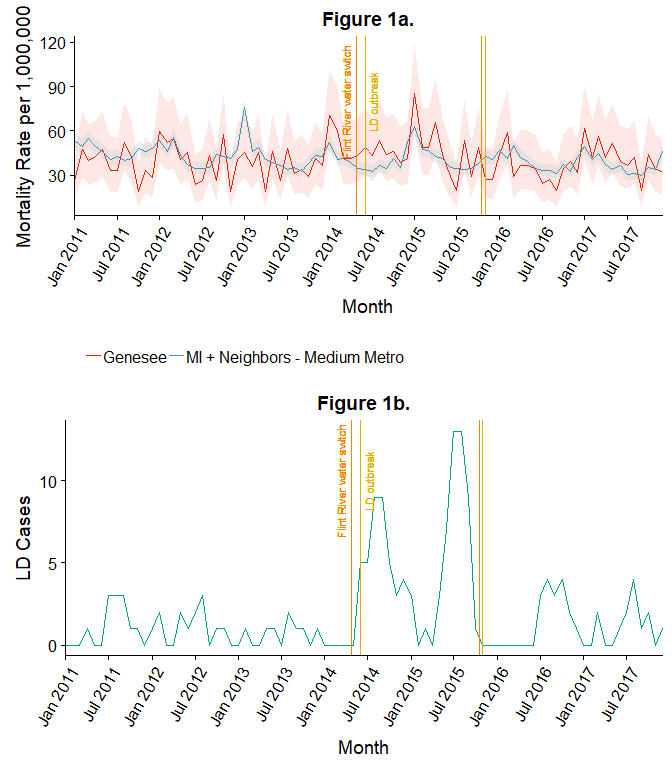
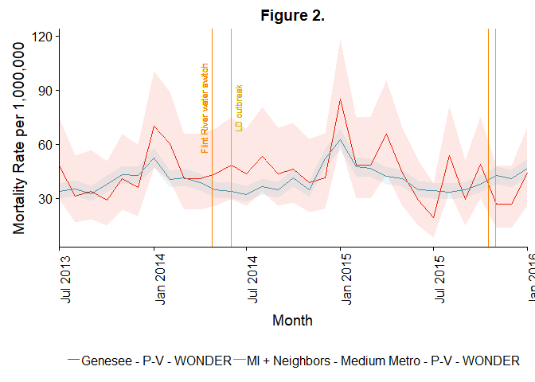
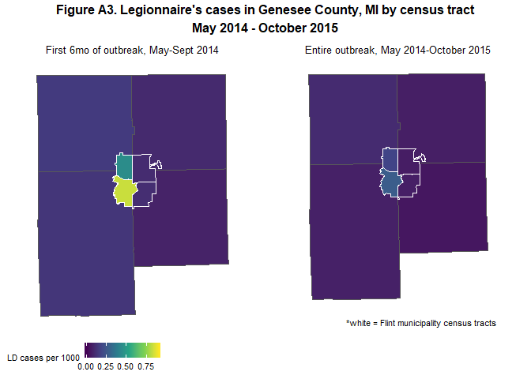

# Abstract

**Introduction**: From June 2014-October 2015, the Michigan Department of Health and Human Services (MDHHS) reported a Legionnaires' disease (LD) outbreak in Genesee County, Michigan, in which the city of Flint is located. MDHHS' final case count for the LD outbreak was 90 cases, including 12 deaths (10 among Genesee County residents). However, it is likely the true outbreak was larger due to unidentified cases. Specifically, some LD cases may have been categorized as general pneumonia.

**Objective**: To estimate excess pneumonia deaths in Genesee County during the 2014-15 LD outbreak and compare this with reported LD death tolls.

**Methods**: We used data from CDC's WONDER system - which tracks monthly death certificates in each U.S. county - on all non-viral pneumonia and LD (P+LD) deaths in residents of Genesee and similar counties in Michigan and neighboring states from 2011-2017. We used a Bayesian negative binomial model to calculate excess P+LD deaths in Genesee from May 2014-October 2015. We began in May 2014 to capture undiagnosed cases before the first identified case. We mapped these excess deaths to assess whether they overlapped geographically with reported LD cases. 

**Results**: We estimated 68.4 excess P+LD deaths (95% credible interval: 27.5 to 114.4) in Genesee County during the LD outbreak. This is substantially higher than the 10 LD deaths among Genesee County residents reported by MDHHS. There is also geographic overlap of the excess P+LD deaths and LD cases, particularly in western Flint and northwestern non-Flint Genesee County.

**Conclusions**: We identified a large number of excess P+LD deaths during the 2014-15 Genesee County LD outbreak. While these findings on pneumonia deaths are consistent with the hypothesis that the LD outbreak was larger than reported, it remains unclear exactly how much larger the LD outbreak may have been.


# Lay Summary

From June 2014-October 2015, MDHHS reported an outbreak of Legionnaires' disease (LD) in Genesee County, Michigan, home of the city of Flint. This outbreak began shortly after the switch in the water source for the city of Flint from Lake Huron to the Flint River (April 2014). It continued through October 2015, ending after the city of Flint switched back to drawing its water from Lake Huron. The source of the outbreak is currently debated, with the two most likely candiates the municipal water system and McLaren Flint Hospital. The final LD tally reported by state agencies was 90 cases, including 12 deaths (10 of whom were Genesee County residents). 

LD is a bacterial respiratory infection resulting in pneumonia. Because it presents like many other pneumonias and can typically be treated with antibiotics, many cases go undetected. This is particularly true when an LD outbreak is not known or suspected.

State agencies reported 10 total LD deaths among Genesee County residents during the outbreak. Using data from a CDC-maintained national death reporting system, we estimated that from May 2014-October 2015 there were in fact *68.4 (95% credible interval: 27.5 to 114.4)* more total pneumonia and LD (P+LD) deaths among Genesee County residents than we would have expected based on what was happening in similar Midwestern counties. These extra deaths also overlapped geographically with many of the reported LD cases. 

Although the first LD case identified by the state was admitted to the hospital in June 2014, pneumonia deaths began an unseasonable uptick in May. This fact, along with the likelihood that the first identified LD case was not the first actual LD case, prompted us to begin counting excess pneumonia deaths in May rather than June. 

Taken together, our results suggest the true death toll - and overall size of the LD outbreak - may have been larger than reported by the state. How much is an open question. There were 6-7x more extra P+LD deaths than reported LD deaths (68.4 vs. 10), but it is unlikely all of these extra deaths were due to LD. Some of them may have been caused by increases in other respiratory diseases or as a consequence of other stresses from the water crisis. This would suggest the true size of the outbreak was somewhere between what MDHHS reported and 6-7x higher. That said, the increase we observed is *specific to Genesee County*, meaning whatever caused these 68.4 deaths should have been occurring there and not elsewhere, even if it was not LD. 

It is also possible some LD deaths were not diagnosed as LD or pneumonia and therefore were not included in our 67.4 extra deaths. Furthermore, it is also possible that LD *cases* were even harder to identify than *deaths*. In other words, the true non-fatal case count could have been even more than 6-7x higher. Because there is no way to retroactively identify undiagnosed LD cases or deaths, it is difficult to know exactly how much larger the total LD outbreak was. 

In any event, the data suggests the LD outbreak was, in fact, larger than reported.

Because LD is a nationally notifiable disease, it is important to note that the state of Michigan almost certainly reported all the cases made known to them by health care providers and laboratories diagnosing the cases. However, the outbreak was not announced publicly until January 2016. Earlier detection and awareness of the outbreak may have allowed identification of additional cases by alerting the medical community and the public to the risk of LD.


# Analysis Setup

First we need to load some necessary packages.

```r
  pacman::p_load(readxl, tidyverse, rstudioapi, rmarkdown, lubridate, epitools, gridExtra, knitr, kableExtra, viridis, stringr, sf, rvest, rgdal, sp, ggsn, RColorBrewer, maptools, here, rgeos, ggthemes, grid, cowplot, ggpubr, brms, tidybayes)
```


# Methods


## Data Sources

Then we need to load our data:


### Data for Analysis of Excess Pneumonia + LD Deaths


1. CDC-reported non-viral pneumonia and LD deaths for residents of Genesee County, MI and 45 control counties.
      
    This is mortality data from [CDC's WONDER Multiple Cause of Death tool](https://wonder.cdc.gov/mcd-icd10.html), which collates information from death certificates nationwide. 

    We pulled data for Genesee County, Michigan and 45 control counties: other "Medium Metro" counties (per [National Center for  Health Statistics 2013 Urbanization Classifications]((https://www.cdc.gov/nchs/data_access/urban_rural.htm))) in Michigan and neighboring states (IL, IN, OH, WI). These counties include metropolitan areas with similar climates to Flint (e.g. Rockford, IL; Ft. Wayne and Evansville, IN; Lansing, MI; and Youngstown, Toledo, and Dayton, OH) and were chosen to reflect the counterfactual of what would have happened to pneumonia deaths in Genesee County absent the LD outbreak, water switch, and other attendant public health changes.

    Deaths were identified in WONDER's Multiple Cause of Death file using ICD-10 codes J15-J18 for non-viral pneumonia plus A48.1 and A48.2 for LD. Pneumonia or LD could appear as any cause of death. LD deaths represented a very small fraction of total pneumonia deaths: there were 24,842 pneumonia deaths in the 45 control counties from 2011-2017 and only 38 (<0.2%) known additional LD deaths during that same time period. The CDC WONDER death counts just for Genesee County are occasionally suppressed because they're <10 per month; in such cases we assumed 10 deaths during the month.
    
       This file also includes monthly LD case counts from [MDHHS' final chartbook report on the outbreak](https://content.govdelivery.com/attachments/MIDHHS/2018/05/29/file_attachments/1014713/GC%2BLegionella%2BChartBook%2BFINAL.pdf).
       


2. Monthly population for Genesee and control counties.

    County-level population data was gathered from the Census and American Fact Finder, Annual Estimates of the Resident Population for Selected Age Groups by Sex for the United States, States, Counties and Puerto Rico Commonwealth and Municipios: April 1, 2010 to July 1, 2017 table (PEPAGESEX). We assumed a simple linear population change between mid-year (July 1) estimates for all counties.
    
    
    ```r
    # Using here() and a folder named 'data' to load files
    # here()
    # Inside here() should be a folder labeled 'data' with all line list data
    # Inside here() should be a secon folder labeled 'shapefiles' with county and census tract shapefiles
    
    #Load monthly CDC WONDER control data + MDHHS LD case counts
    pneu_wonder <- read_excel(path=here("data/WONDER_Data.xlsx"),
                          sheet = "WONDER") 
    
    #Load month-to-quarter lookup table
    qtrs <- read.csv(here("data/quarters.csv"))
    # colnames(qtrs) <- c("Month_Code", "Quarter", "Month", "FluSeason")
    #NOTE: "FluSeason = 2013" runs from October 2012-September 2013, and so on. Because
    #"pneumonia" deaths often vary substantially based on flu severity we chose to use a
    #October-September rather than a traditional calendar year to control for long-term
    #year-to-year changes in pneumonia mortality.
    
     #Load county-level population data
      #NOTE: Monthly populations calculated in Excel assuming linear trend between Census midpoint (July 1) estimates for each year
      pop <- read_excel(path = here("data/WONDER_Data.xlsx"),
                    sheet = "Pop_Census_AFF")
      pop <- pop[, -grep("Mid", colnames(pop))]
      
    #Load all Genesee County pneumonia deaths
    pneu_genesee <- read_excel(path=here("data/Deidentified Pneumonia deaths GeoId.xlsx"),
                          sheet = "All",
                          col_types = c("numeric", "date", "text", "text", "numeric"))
    ```
    

### Data for Mapping Analyses

3. Genesee County LD cases. 

    This file was provided by the journalists at *Frontline*. Note that this data includes 67 cases and 33 deaths. MDHHS' final report, in contrast, reports 90 cases and 12 deaths (10 of whom were Genesee County residents). 

    The *Frontline* list was based off a line list of 46 cases from Genesee County that covers the first "wave" from June 2014-March 2015 (MDHHS's final chartbook indicates there were 44 rather than 46 cases during this time period); a second wave ran from May 2015-October 2015, but per *Frontline* no one has gotten the full case list for that time period. *Frontline* then identified 31 additional cases from legal cases and news reports, for 67 total cases. 
    
    *Frontline* considered anyone who died at any time after contracting LD is included as a death in this list. MDHHS only classified patients who died within 30 days of contracting LD as an LD death. This explains the 21 additional deaths in the *Frontline* list.

    The Frontline data thus: 
      + is missing 23 LD cases 
      + identifies 21 additional deaths outside the 30-day window used by MDHHS
      
    Each LD case is also given a GEOID, the components of which are:
      + STATE CODE: FIRST 2 DIGITS 
      + COUNTY CODE: NEXT 3 DIGITS
      + CENSUS TRACT: LAST 6 DIGITS 

      A note on dates used in the mapping analysis:  
      + For LD cases, the data includes a date of death (if the patient died) and a date of hospital admission. Of the 67 cases in the *Frontline* list, 57 have a hospital admission date and an additional 3 have a date of death only (missing hospitalization date). In the mapping analysis, we use date of death for cases who died within 30 days of their hospital admit date and the date of hospital admission for other cases.  
      + For pneumonia deaths, death date is always used as this is the data available on the death certificate. 
        
        We excluded 9 cases that were not known Genesee residents and 3 additional surviving cases without a hospital admission date. The number of cases used for the mapping analysis is 55.

4. Genesee County Pneumonia Deaths with mapping data.

    This file was provided by *Frontline*, who abstracted the data from death certificates they obtained from the Genesee County Vital Records Division (GCVRD)/Clerks' Office via a FOIA Request. This death list differs from the CDC WONDER list, but the exact source of these differences is unknown. These deaths are used only for the mapping portion of the analysis.

    This file includes all those who died in Genesee County, but GEOIDs are provided only for those who were residents of Genesee County. There are 2041 total pnuemonia deaths in this file. 280 were non-Genesee County residents, and 10 additional cases lacked GEOIDs. Thus there are 1,751 Genesee County pneumonia deaths with location information in this dataset. These are the pneumonia deaths we'll map by census tract of residence.
      

5. Shapefiles for Michigan showing census tract boundaries in Genesee County.

     2010 Census County and census-tract level shapefiles for Michigan were obtained from [here](http://gis-michigan.opendata.arcgis.com/datasets/2010-census-tracts-v17a).


6. Census tract-level population data. 

    Census tract-level population data was obtained from the [Census and American Fact Finder](https://factfinder.census.gov/faces/nav/jsf/pages/searchresults.xhtml?refresh=t).


```r
# Read in data on LD deaths/cases
ld <- read.csv(here("data/Genesee County Legionnaires deaths De-Identified GEOIDS.csv"))
ld_red <-  as.data.frame(cbind(ld$Unique.ID, 
                               as.character(mdy(ld$HospitalAdmitDate)), 
                               as.character(mdy(ld$DateOf.Death)), 
                               as.character(ld$CountyVsCity), 
                               as.character(ld$GeoID), 
                               as.character(ld$DiedWhileHospitalizedWithLegionnairesOrWithin30DaysFromLeavingHospital)))
```

```
## Warning: 34 failed to parse.
```

```r
colnames(ld_red) <- c("UniqueID", "HospAdmitDate", "DateofDeath", "countycity", "GeoID", "usedeathdate")

ld_red <- ld_red[ld_red$countycity == "COUNTY -- genesee" | ld_red$countycity == "CITY -- Flint", ]  # Remove LD cases not residents of GC (n=2)
ld_red <- ld_red[!is.na(ld_red$HospAdmitDate), ]  # Remove cases without Hospital Admit Dates (n=10)


# Read in data on pneumonia deaths
pd <- read.csv(here("data/Deidentified Pneumonia deaths GeoId.csv"))
pd_red <- pd[1:2041,1:5] # there are some empty rows and columns being pulled in, so remove them here.
pd_red <-  as.data.frame(cbind(pd$UniqueID, as.character(mdy(pd$DateOfDeath)), as.character(pd$GeoID), as.character(pd$LocationGeneralized)))
colnames(pd_red) <- c("UniqueID", "DateofDeath", "GeoID", "loc")

pd_red <- pd_red[((pd_red$loc=="COUNTY -- genesee") | (pd_red$loc=="CITY -- flint") | (pd_red$loc=="COUNTY -- genesee**") ), ] #Remove pnuemo deaths of non-GC residents
pd_red <- pd_red[!(is.na(pd_red$GeoID)), ]  # Remove pneumo deaths with no location information
pd_red <- pd_red[!(is.na(pd_red$DateofDeath)), ]  # Remove anyone with missing date of death 


# Use the 9-digit GEO code, representin census tract/county information
pd_red$ctr <- str_sub(pd_red$GeoID , -9)
ld_red$ctr <- str_sub(ld_red$GeoID , -9)

# Read in Genesee County shapefiles and population statistics
counties <- st_read(here("data/Counties_v17a/Counties_v17a.shp"))
```

```
## Reading layer `Counties_v17a' from data source `C:\Users\elzat\Dropbox\Frontline_Legionella\Analysis\Final_Analysis\data\Counties_v17a\Counties_v17a.shp' using driver `ESRI Shapefile'
## Simple feature collection with 83 features and 15 fields
## geometry type:  MULTIPOLYGON
## dimension:      XY
## bbox:           xmin: -90.41829 ymin: 41.69613 xmax: -82.41348 ymax: 48.26269
## epsg (SRID):    4326
## proj4string:    +proj=longlat +datum=WGS84 +no_defs
```

```r
ctracts <- st_read(here("data/2010_Census_Tracts_v17a/2010_Census_Tracts_v17a.shp"))
```

```
## Reading layer `2010_Census_Tracts_v17a' from data source `C:\Users\elzat\Dropbox\Frontline_Legionella\Analysis\Final_Analysis\data\2010_Census_Tracts_v17a\2010_Census_Tracts_v17a.shp' using driver `ESRI Shapefile'
## Simple feature collection with 2773 features and 14 fields
## geometry type:  MULTIPOLYGON
## dimension:      XY
## bbox:           xmin: -90.41829 ymin: 41.69613 xmax: -82.41348 ymax: 48.26269
## epsg (SRID):    4326
## proj4string:    +proj=longlat +datum=WGS84 +no_defs
```

```r
ctracts_pop <- read.csv(here("data/pop_byctract.csv"))
```


## Data Cleaning and Wrangling

The code used for cleaning and wrangling the data is below. In a nutshell, to prepare for visualizing and modeling excess non-viral pneumonia + LD deaths we: 

* Counted the *Frontline* pneumonia deaths and linked them to WONDER data (for a sensitivity analysis only)
* Calculated total population for Genesee and control counties for each month and linked this to the CDC WONDER death data
* Calculated a mortality rate and 95% CIs around the rate using a Poisson distribution


```r
#Count Genesee County pneumonia deaths by month and link to WONDER data
pd_link <- pd %>% 
  mutate(DateOfDeath = as.Date(DateOfDeath, format = "%m/%d/%Y")) %>% 
  filter(!grepl("virus|viral", CauseOfDeath, ignore.case = TRUE)) %>% #Exclude known viral pneumonias
  mutate(Month_Code = str_c(year = year(DateOfDeath), "/", format.Date(DateOfDeath, "%m"),
                            sep = ""),
         Loc_temp = str_sub(LocationGeneralized, 1, 5)) %>% 
  filter(Loc_temp != "OTHER") %>% #Exclude non_Genesee residents for comparison with WONDER
  select(-Loc_temp) %>% 
  group_by(Month_Code) %>% 
  summarize(Deaths = n()) %>% 
  mutate(Deaths_Type = "P-V",
         Control_Type = "Genesee",
         Geography = "Genesee",
         Source = "GCVRD")

deaths_full <- pneu_wonder %>% 
  select(Month_Code, Deaths, Control_Type:Source) %>% 
  rbind(pd_link) %>% 
  filter(Geography %in% c("Genesee", "MI + Neighbors - Medium Metro")) #Restrict to only Genesee and control counties - ignore other data (other possible control groups)
rm(pd_link)
  

#Link in population information 
  
  #Calculate populations for Genesee and control counties
  controls_pop <- pop %>% 
    filter(Geography != "Genesee County, Michigan",
           Urb_2013 == "Medium Metro",
           State %in% c("Michigan", "Illinois", "Indiana", "Wisconsin", "Ohio")) %>%
    summarize_at(vars(`2011/01`:`2017/12`), sum) %>%
    t() %>% 
    data.frame() %>% 
    rename(Pop = 1) %>% 
    rownames_to_column(var = "Month_Code") %>% 
    mutate(Geography = "MI + Neighbors - Medium Metro",
           Control_Type = "Medium Metro")
  
  genesee_pop <- pop %>% 
    filter(Geography == "Genesee County, Michigan") %>%
    summarize_at(vars(`2011/01`:`2017/12`), sum) %>%
    t() %>% 
    data.frame() %>% 
    rename(Pop = 1) %>% 
    rownames_to_column(var = "Month_Code") %>% 
    mutate(Geography = "Genesee",
           Control_Type = "Genesee")
  
  pop_link <- rbind(controls_pop, genesee_pop)
  rm(controls_pop, genesee_pop)
  
  #Final linkage and calculation of pneumonia mortality rates
  deaths_full <- deaths_full %>% 
    left_join(pop_link, by = c("Month_Code", "Control_Type", "Geography")) %>% 
    mutate(Deaths = case_when(Deaths == "Suppressed" ~ 10, #WONDER suppresses if deaths < 10
                              TRUE ~ as.numeric(Deaths)),
           rate = Deaths/Pop * 1e6,
           graph_group = str_c(Geography, " - ", Deaths_Type, " - ", Source),
           Year = factor(str_sub(Month_Code, 1, 4))) %>% 
    left_join(qtrs, by = "Month_Code") %>% 
    mutate(axis_date = as.Date(str_c(str_sub(Month_Code, 1, 4), "-",
                             str_sub(Month_Code, 6, 7),"-01")),
           FluSeason = factor(FluSeason))
```

```
## Warning in eval_tidy(pair$rhs, env = default_env): NAs introduced by
## coercion
```

```
## Warning: Column `Month_Code` joining character vector and factor, coercing
## into character vector
```

```r
  #Add in 95% CIs for rates
  ci <- pois.exact(x = deaths_full$Deaths, pt = deaths_full$Pop, conf.level = 0.95)
  deaths_full <- deaths_full %>% 
    mutate(rate_ll = ci$lower*1e6,
           rate_ul = ci$upper*1e6)
  rm(ci)

#Dates to place vertical lines on figures below  
water_dates <- c(as.Date("2014-04-25"), as.Date("2015-10-16"))
leg_ob_dates <- c(as.Date("2014-06-01"), as.Date("2015-10-31"))
```


For the mapping analyses we:
    
* Brought in geographic 'shapefiles' to use for mapping


```r
## Filter shapefiles to keep only what we'll need for maps

# Create shapefile with only census tracts in Genesee County
gc_ctracts <- ctracts %>%
  filter(CNTY_CODE == "049")
# This leaves 131 census tracts in GC

# Create shapefile with only Genesee County for map insets
gc_county <- counties %>%
  filter(CNTY_CODE == "049")

# ID all Flint census tracts, so can highlight in maps
ctracts$NAME <- as.character(ctracts$NAME)
flint_ctracts <- ctracts %>%
  filter(NAME %in% c("000100", "000200", "000300", "000400", "000500", "000600", "000700", "000800", "000900", "001000", "001100",  
                     "001200", "001300", "001400", "001500", "001600", "001700", "001800", "001900", "002000", "002100", "002200",
                     "002300", "002400", "002500", "002600", "002700", "002800", "002900", "003000",
                     "003100", "003200", "003300", "003400", "003500", "003600", "003700", "003800", "003900", "004000"
                     )
         & CNTY_CODE == "049")

# Define quadrants of Flint to use in maps
nw_tracts <- c("000100", "000200", "000300", "000400", "000500", "000600", "000700", "000800", "000900", "001000", "001100")
ne_tracts <- c("001700", "001800", "001900", "002000", "002200", "980100", "013600", "002300", "002400", "002600", "002700")
sw_tracts <- c("001200", "001300", "001400", "001500", "001600", "002800", "003600", "003700", "013500")
se_tracts <- c("002900", "003000", "003100", "003200", "003300", "003400", "003500", "003800", "004000")

flint_ctracts_nw <- ctracts %>%
  filter(NAME %in% nw_tracts
         & CNTY_CODE == "049")


flint_ctracts_ne <- ctracts %>%
  filter(NAME %in% ne_tracts
         & CNTY_CODE == "049")

flint_ctracts_sw <- ctracts %>%
  filter(NAME %in% sw_tracts
         & CNTY_CODE == "049")

flint_ctracts_se <- ctracts %>%
  filter(NAME %in% se_tracts
         & CNTY_CODE == "049")

# Define quadrants of non-Flint census tracts to use in maps
nw_nonfl_tracts <- c("012601", "012602", "012603", "010201", "010111", "010112", "010110", "010202", "010113", "010114", "010115", "000107", "010610", "010604", "010603", "010503", "010502", "010501", "010504", "012310", "010305", "010304", "010700")
ne_nonfl_tracts <- c("012504", "012503", "012501", "012401", "012402", "012311", "012201", "012202", "001210", "012007", "012003", "012008", "012009", "012006", "011901", "001180", "011902", "012100", "011800")
sw_nonfl_tracts <- c("012703", "012704", "010810", "010813", "010811", "010910", "010812", "010911", "012702", "010912", "980000", "011010", "012801", "012802", "012904", "012907", "012905", "012906", "013001", "013002", "013110", "013113", "013111", "013112", "013204", "013202", "013301")
se_nonfl_tracts <- c("011505", "011508", "011502", "011503", "011714", "011713", "011610", "011710", "011711", "011712", "011601", "011301", "011302", "011401", "011402", "011601", "011212", "011213", "011211", "011214", "011209", "011210", "011101", "011102", "013401", "013402")

nonflint_ctracts_nw <- ctracts %>%
  filter(NAME %in% nw_nonfl_tracts
         & CNTY_CODE == "049")


nonflint_ctracts_ne <- ctracts %>%
  filter(NAME %in% ne_nonfl_tracts
         & CNTY_CODE == "049")

nonflint_ctracts_sw <- ctracts %>%
  filter(NAME %in% sw_nonfl_tracts
         & CNTY_CODE == "049")

nonflint_ctracts_se <- ctracts %>%
  filter(NAME %in% se_nonfl_tracts
         & CNTY_CODE == "049")
```

* Defined the time periods of interest for the maps, which are:
    
       + The entire duration of the LD outbreak: May 2014 - October 2015 
       + The first 6 months of the LD outbreak: May - October 2014 
          - The modeling analysis showed that the majority of excess deaths were concentrated in the first 6 months after the water switch.
       + Before the LD outbreak: January 2011 - April 2014 
       + After the LD outbreak: November 2015 - Jan 2018 
       
       In addition, look at the same months as the intense period of the LD outbreak (June-Oct) in the before and after periods. This is
       + May-Oct 2011, 2012, 2013
       + May-Oct 2016, 2017
       

```r
# Define the time periods of interest for maps.
  
# 1. The entire duration of Legionnaires' outbreak: May 2014 - October 2015 ('out')
# 2. The first 6 months of Legionnaires' outbreak: May 2014 - October 2014 ('frst6mo')
        # - Previous analysis showed that the majority of excess deaths were concentrated in the first 6 months of the outbreak.
        # - Note that the entire outbreak period (#1) INCLUDES this first 6 months.
# 3. Before the Legionnaires' outbreak: January 2011 - April 2014 ('b4')
# 4. After the Legionnaires' outbreak: November 2015 - Jan 2018 ('after')

# 5. Before the Legionnaires' outbreak, month match: May - Oct in 2011, 2012, 2013 ('b4.match')
# 6. After the Legionnaires' outbreak, month match: May - Oct in 2016, 2017 ('after.match')

# Create time intervals corresponding to the above periods.
out <- interval(ymd(20140501), ymd(20151031))
frst6mo <- interval(ymd(20140501), ymd(20141031))

after <- interval(ymd(20151101), ymd(20180101))
b4 <- interval(ymd(20110101), ymd(20140430))

b4.match.2011 <- interval(ymd(20110501), ymd(20111031))
b4.match.2012 <- interval(ymd(20120501), ymd(20121031))
b4.match.2013 <- interval(ymd(20130501), ymd(20131031))
after.match.2016 <- interval(ymd(20160501), ymd(20161031))
after.match.2017 <- interval(ymd(20170501), ymd(20171031))
                         
# Create date to use for classification: if died, use date of death if died within 30 days of hospital admit; if survived, use date of hospital admission. (see above)

ld_red$classdate <- if_else((ld_red$usedeathdate == "YES"), as.Date(ld_red$DateofDeath), as.Date(ld_red$HospAdmitDate), missing = NULL)

# Create indicator variables for time period that each LD case falls into.
ld_red$frst6mo[ymd(ld_red$classdate) %within% frst6mo] <- 1
# table(ld_red$frst5mo)
# 26 cases

ld_red$out[ymd(ld_red$classdate) %within% out] <- 1
# table(ld_red$out)
# 47 cases

ld_red$after[ymd(ld_red$classdate) %within% after] <- 1
# table(ld_red$after)
# 10 cases

# Create indicator variables for time period that each pneumonia death falls into.
pd_red$b4[ymd(pd_red$DateofDeath) %within% b4] <- 1
#table(pd_red$b4)
# 890 deaths total

pd_red$frst6mo[ymd(pd_red$DateofDeath) %within% frst6mo] <- 1
#table(pd_red$frst5mo)
# 115 deaths total

pd_red$out[ymd(pd_red$DateofDeath) %within% out] <- 1
#table(pd_red$out)
# 398 deaths total

pd_red$after[ymd(pd_red$DateofDeath) %within% after] <- 1
#table(pd_red$after)
# 487 deaths total

pd_red$b4.match[ymd(pd_red$DateofDeath) %within% b4.match.2011] <- 1
pd_red$b4.match[ymd(pd_red$DateofDeath) %within% b4.match.2012] <- 1
pd_red$b4.match[ymd(pd_red$DateofDeath) %within% b4.match.2013] <- 1
#table(pd_red$b4.match)
# 285 deaths total

pd_red$after.match[ymd(pd_red$DateofDeath) %within% after.match.2016] <- 1
pd_red$after.match[ymd(pd_red$DateofDeath) %within% after.match.2017] <- 1
#table(pd_red$after.match)
# 159 deaths total


# Create variables which aggregate pnuemonia/LD deaths/cases per census tract by each time period (to be merged with shapefile)
pd_b4 <- pd_red %>% group_by(ctr, b4) %>% tally()
pd_b4 <- pd_b4[!is.na(pd_b4$b4), ]
colnames(pd_b4) <- c("ctr", "pd_b4", "n_pd_b4")

pd_b4.m <- pd_red %>% group_by(ctr, b4.match) %>% tally()
pd_b4.m <- pd_b4.m[!is.na(pd_b4.m$b4.match), ]
colnames(pd_b4.m) <- c("ctr", "pd_b4.m", "n_pd_b4.m")

pd_frst6mo <- pd_red %>% group_by(ctr, frst6mo) %>% tally()
pd_frst6mo <- pd_frst6mo[!is.na(pd_frst6mo$frst6mo), ]
colnames(pd_frst6mo) <- c("ctr", "pd_frst6mo", "n_pd_frst6mo")

pd_out <- pd_red %>% group_by(ctr, out) %>% tally()
pd_out <- pd_out[!is.na(pd_out$out), ]
colnames(pd_out) <- c("ctr", "pd_out", "n_pd_out")

pd_after <- pd_red %>% group_by(ctr, after) %>% tally()
pd_after <- pd_after[!is.na(pd_after$after), ]
colnames(pd_after) <- c("ctr", "pd_after", "n_pd_after")

pd_after.m <- pd_red %>% group_by(ctr, after.match) %>% tally()
pd_after.m <- pd_after.m[!is.na(pd_after.m$after.match), ]
colnames(pd_after.m) <- c("ctr", "pd_after.m", "n_pd_after.m")


ld_frst6mo <- ld_red %>% group_by(ctr, frst6mo) %>% tally()
ld_frst6mo <- ld_frst6mo[!is.na(ld_frst6mo$frst6mo), ]
colnames(ld_frst6mo) <- c("ctr", "ld_frst6mo", "n_ld_frst6mo")

ld_out<- ld_red %>% group_by(ctr, out) %>% tally()
ld_out <- ld_out[!is.na(ld_out$out), ]
colnames(ld_out) <- c("ctr", "ld_out", "n_ld_out")
```

* Calculated incidence in each time period for both LD cases and pneumonia mortality


```r
# Extract the last 9 digits of the GEO code (which indicate census tract, county) for linking with shapefile
ctracts_pop$Id2 <- as.character(ctracts_pop$Id2)
ctracts_pop$Id2 <- str_sub(ctracts_pop$Id2 , -9)


# Merge population numbers by census tract with shapefile
gc_ctracts$LINK <- as.character(gc_ctracts$LINK)
ctracts_pop_merge <- left_join(gc_ctracts, ctracts_pop, by = c("LINK" = "Id2"))


# Merge pneumonia and LD death counts by time period with Genesee county shapefile  
pd_b4$ctr <- as.character(pd_b4$ctr)
pd_b4.m$ctr <- as.character(pd_b4.m$ctr)
pd_frst6mo$ctr <- as.character(pd_frst6mo$ctr)
pd_out$ctr <- as.character(pd_out$ctr)
pd_after$ctr <- as.character(pd_after$ctr)
pd_after.m$ctr <- as.character(pd_after.m$ctr)

ctracts_merge1 <- left_join(ctracts_pop_merge, pd_frst6mo, by = c( "LINK" = "ctr"))
ctracts_merge2 <- left_join(ctracts_merge1, pd_out, by = c( "LINK" = "ctr"))
ctracts_merge3 <- left_join(ctracts_merge2, pd_b4, by = c( "LINK" = "ctr"))
ctracts_merge4 <- left_join(ctracts_merge3, pd_b4.m, by = c( "LINK" = "ctr"))
ctracts_merge5 <- left_join(ctracts_merge4, pd_after, by = c( "LINK" = "ctr"))
ctracts_merge6 <- left_join(ctracts_merge5, pd_after.m, by = c( "LINK" = "ctr"))
ctracts_merge7 <- left_join(ctracts_merge6, ld_frst6mo, by = c( "LINK" = "ctr"))
ctracts_merge  <- left_join(ctracts_merge7, ld_out, by = c( "LINK" = "ctr"))


# Calculate incidence per 1000 for pnuemonia mortality and LD by census tract in each time period
ctracts_merge$inc_pd_b4 <- (ctracts_merge$n_pd_b4 / ctracts_merge$totpop) * 1000 * (12/40)
ctracts_merge$inc_pd_b4.m <- (ctracts_merge$n_pd_b4.m / ctracts_merge$totpop) * 1000 * (12/18)
ctracts_merge$inc_pd_frst6mo <- (ctracts_merge$n_pd_frst6mo / ctracts_merge$totpop) * 1000 * (12/6) 
ctracts_merge$inc_pd_out <- (ctracts_merge$n_pd_out / ctracts_merge$totpop) * 1000 * (12/18)
ctracts_merge$inc_pd_after <- (ctracts_merge$n_pd_after / ctracts_merge$totpop) * 1000 * (12/26)
ctracts_merge$inc_pd_after.m <- (ctracts_merge$n_pd_after.m / ctracts_merge$totpop) * 1000 * (12/18)


ctracts_merge$inc_ld_frst6mo <- (ctracts_merge$n_ld_frst6mo / ctracts_merge$totpop) * 1000 * (12/6) 
ctracts_merge$inc_ld_out <- (ctracts_merge$n_ld_out / ctracts_merge$totpop) * 1000 * (12/18)


# If counts are 0, result is NA, so make these zeros instead
ctracts_merge$inc_pd_b4[is.na(ctracts_merge$inc_pd_b4)] <- 0
ctracts_merge$inc_pd_b4.m[is.na(ctracts_merge$inc_pd_b4.m)] <- 0

ctracts_merge$inc_pd_frst6mo[is.na(ctracts_merge$inc_pd_frst6mo)] <- 0
ctracts_merge$inc_pd_out[is.na(ctracts_merge$inc_pd_out)] <- 0

ctracts_merge$inc_pd_after[is.na(ctracts_merge$inc_pd_after)] <- 0
ctracts_merge$inc_pd_after.m[is.na(ctracts_merge$inc_pd_after.m)] <- 0

ctracts_merge$inc_ld_frst6mo[is.na(ctracts_merge$inc_ld_frst6mo)] <- 0
ctracts_merge$inc_ld_out[is.na(ctracts_merge$inc_ld_out)] <- 0


# Calculate rate differences between outbreak and pre-outbreak periods
ctracts_merge$inc_pd_diff <- ctracts_merge$inc_pd_out - ctracts_merge$inc_pd_b4


# Now, group case data by census tract region
ctracts_merge_group <- ctracts_merge %>%
                       mutate(group = case_when(as.character(NAME) %in% nw_tracts ~ 'nw',
                                                as.character(NAME) %in% ne_tracts ~ 'ne',
                                                as.character(NAME) %in% sw_tracts ~ 'sw',
                                                as.character(NAME) %in% se_tracts ~ 'se')) %>%
                       filter(!is.na(group))

ctracts_merge_group2 <- ctracts_merge %>%
                       mutate(group = case_when(as.character(NAME) %in% nw_nonfl_tracts ~ 'nw_nonfl',
                                                as.character(NAME) %in% ne_nonfl_tracts ~ 'ne_nonfl',
                                                as.character(NAME) %in% sw_nonfl_tracts ~ 'sw_nonfl',
                                                as.character(NAME) %in% se_nonfl_tracts ~ 'se_nonfl')) %>%
                       filter(!is.na(group))


# Summarise by grouping variable. This performs a union on grouped polygons (census tracts) and sums up cases/deaths in them
ctracts_merge_quad <- group_by(ctracts_merge_group, group) %>% 
  summarise(totpop = sum(totpop, na.rm = TRUE),
            n_ld_out = sum(n_ld_out, na.rm = TRUE),
            n_ld_frst6mo = sum(n_ld_frst6mo, na.rm = TRUE),
            n_pd_b4 = sum(n_pd_b4, na.rm = TRUE), 
            n_pd_frst6mo = sum(n_pd_frst6mo, na.rm = TRUE),
            n_pd_out = sum(n_pd_out, na.rm = TRUE),
            n_pd_after = sum(n_pd_after, na.rm = TRUE) )

ctracts_merge_nonflint_quad <- group_by(ctracts_merge_group2, group) %>% 
  summarise(totpop = sum(totpop, na.rm = TRUE),
            n_ld_out = sum(n_ld_out, na.rm = TRUE),
            n_ld_frst6mo = sum(n_ld_frst6mo, na.rm = TRUE),
            n_pd_b4 = sum(n_pd_b4, na.rm = TRUE), 
            n_pd_frst6mo = sum(n_pd_frst6mo, na.rm = TRUE),
            n_pd_out = sum(n_pd_out, na.rm = TRUE),
            n_pd_after = sum(n_pd_after, na.rm = TRUE) )


# Calculate incidence in quadrants, rather than individual census tracts
# Do this because some census tracts may have low numbers of cases, so this prevents those census tracts from distorting the map too much.
ctracts_merge_quad$inc_pd_b4 <- (ctracts_merge_quad$n_pd_b4 / ctracts_merge_quad$totpop) * 1000 * (12/41)
ctracts_merge_quad$inc_pd_frst6mo <- (ctracts_merge_quad$n_pd_frst6mo / ctracts_merge_quad$totpop) * 1000 * (12/5) 
ctracts_merge_quad$inc_pd_out <- (ctracts_merge_quad$n_pd_out / ctracts_merge_quad$totpop) * 1000 * (12/17)
ctracts_merge_quad$inc_pd_after <- (ctracts_merge_quad$n_pd_after / ctracts_merge_quad$totpop) * 1000 * (12/39)

ctracts_merge_quad$inc_ld_frst6mo <- (ctracts_merge_quad$n_ld_frst6mo / ctracts_merge_quad$totpop) * 1000 * (12/5) 
ctracts_merge_quad$inc_ld_out <- (ctracts_merge_quad$n_ld_out / ctracts_merge_quad$totpop) * 1000 * (12/17)

ctracts_merge_quad$inc_pd_diff <- ctracts_merge_quad$inc_pd_out - ctracts_merge_quad$inc_pd_b4

ctracts_merge_quad$inc_pd_b4[is.na(ctracts_merge_quad$inc_pd_b4)] <- 0
ctracts_merge_quad$inc_pd_frst6mo[is.na(ctracts_merge_quad$inc_pd_frst6mo)] <- 0
ctracts_merge_quad$inc_pd_out[is.na(ctracts_merge_quad$inc_pd_out)] <- 0
ctracts_merge_quad$inc_pd_after[is.na(ctracts_merge_quad$inc_pd_after)] <- 0

ctracts_merge_quad$inc_ld_frst6mo[is.na(ctracts_merge_quad$inc_ld_frst6mo)] <- 0
ctracts_merge_quad$inc_ld_out[is.na(ctracts_merge_quad$inc_ld_out)] <- 0

# Calculate incidence in NON-FLINT quadrants, rather than individual census tracts
# Do this because some census tracts may have low numbers of cases, so this prevents those census tracts from distorting the map too much.
ctracts_merge_nonflint_quad$inc_pd_b4 <- (ctracts_merge_nonflint_quad$n_pd_b4 / ctracts_merge_nonflint_quad$totpop) * 1000 * (12/40)          # 40 months (Jan 2011-Apr 2014)
ctracts_merge_nonflint_quad$inc_pd_frst6mo <- (ctracts_merge_nonflint_quad$n_pd_frst6mo / ctracts_merge_nonflint_quad$totpop) * 1000 * (12/6) # 6 months (May 2014 - Oct 2014)
ctracts_merge_nonflint_quad$inc_pd_out <- (ctracts_merge_nonflint_quad$n_pd_out / ctracts_merge_nonflint_quad$totpop) * 1000 * (12/18)        # 18 months (May 2014 - Oct 2015)
ctracts_merge_nonflint_quad$inc_pd_after <- (ctracts_merge_nonflint_quad$n_pd_after / ctracts_merge_nonflint_quad$totpop) * 1000 * (12/39)    # 39 months (Oct 2015 - Jan 2018)

ctracts_merge_nonflint_quad$inc_ld_frst6mo <- (ctracts_merge_nonflint_quad$n_ld_frst6mo / ctracts_merge_nonflint_quad$totpop) * 1000 * (12/6) 
ctracts_merge_nonflint_quad$inc_ld_out <- (ctracts_merge_nonflint_quad$n_ld_out / ctracts_merge_nonflint_quad$totpop) * 1000 * (12/18)

ctracts_merge_nonflint_quad$inc_pd_diff <- ctracts_merge_nonflint_quad$inc_pd_out - ctracts_merge_nonflint_quad$inc_pd_b4

ctracts_merge_nonflint_quad$inc_pd_b4[is.na(ctracts_merge_nonflint_quad$inc_pd_b4)] <- 0
ctracts_merge_nonflint_quad$inc_pd_frst6mo[is.na(ctracts_merge_nonflint_quad$inc_pd_frst6mo)] <- 0
ctracts_merge_nonflint_quad$inc_pd_out[is.na(ctracts_merge_nonflint_quad$inc_pd_out)] <- 0
ctracts_merge_nonflint_quad$inc_pd_after[is.na(ctracts_merge_nonflint_quad$inc_pd_after)] <- 0

ctracts_merge_nonflint_quad$inc_ld_frst6mo[is.na(ctracts_merge_nonflint_quad$inc_ld_frst6mo)] <- 0
ctracts_merge_nonflint_quad$inc_ld_out[is.na(ctracts_merge_nonflint_quad$inc_ld_out)] <- 0


# This is to take a look at any outliers, specifically census tracts with low populations and high case counts
#ld_out_outliers <- ggplot(ctracts_merge, aes(x = totpop, y = inc_ld_out)) +
#  geom_point() +
#  ylab("LD, during") +
#  theme(axis.title.y=element_text(size=10))

#ld_frst5mo_outliers <- ggplot(ctracts_merge, aes(x = totpop, y = inc_ld_frst5mo)) +
#  geom_point() +
#  ylab("LD, first 6mo") +
#  theme(axis.title.y=element_text(size=10))

#pd_b4_outliers <- ggplot(ctracts_merge, aes(x = totpop, y = inc_pd_b4)) +
#  geom_point() +
#  ylab("Pneumo, before outbreak") +
#  theme(axis.title.y=element_text(size=10))

#pd_frst5mo_outliers <- ggplot(ctracts_merge, aes(x = totpop, y = inc_pd_frst5mo)) +
#  geom_point() +
#  ylab("Pneumo, first 6mo") +
#  theme(axis.title.y=element_text(size=10))


#pd_out_outliers <- ggplot(ctracts_merge, aes(x = totpop, y = inc_pd_out)) +
#  geom_point() +
#  xlab("CT Population") +
#  ylab("Pneumo, during") +
#  theme(axis.title.y=element_text(size=10))

#grid.arrange(ld_out_outliers, ld_frst5mo_outliers, pd_b4_outliers, pd_frst5mo_outliers, pd_out_outliers, nrow = 5)
```


# Results

## Analysis of Excess Pneumonia + LD Deaths

### Visualizing Deaths Over Time

**Figure 1a** is a plot of P+LD death rates by month and year for Genesee County and the 45 control counties, both from WONDER. The time between the vertical blue lines delineate the start and end of the Flint municipal water source change from Detroit to the Flint River (04/25/2014-10/16/2015); the vertical green lines delineate the official start and end of the Flint LD outbreak per MDHHS (June 2014-October 2015). The shaded areas represent 95% confidence intervals (CIs) for the monthly rates.

**Figure 1b** depicts Genesee County LD cases by month per MDHHS.


```r
graph <- deaths_full %>%
  filter(axis_date <= "2017-12-31") %>% 
  filter(Deaths_Type == "P-V" & 
           ((Geography == "MI + Neighbors - Medium Metro" & Source == "WONDER") |
           (Geography == "Genesee" & Source == "WONDER"))) %>%
  select(Geography, rate, rate_ll, rate_ul, axis_date)


p1 <- graph %>% 
  ggplot(aes(x = axis_date, y = rate, group = Geography, color = Geography, fill = Geography)) + 
  geom_line() +
  geom_ribbon(aes(ymin = rate_ll, ymax = rate_ul), alpha = 0.1, show.legend = FALSE, linetype = 0) +
  xlab("Month") +
  ylab("Mortality Rate per 1,000,000") +
  theme(legend.title = element_blank(), legend.position = "bottom",
        axis.text.x = element_text(angle = 90)) +
  scale_x_date(date_breaks = '6 months',
        date_labels = '%m%Y',
        expand = c(0,0)) +
  geom_vline(xintercept = water_dates, color = "blue") +   
  geom_text(aes(x = water_dates[1], label="\nFlint River water switch", y=80), color="blue", angle=90, size = 3, vjust = -0.25) +
geom_vline(xintercept = leg_ob_dates, color = "darkgreen") +   
  geom_text(aes(x = leg_ob_dates[1], label="\nLD outbreak", y=80), color="darkgreen", angle=90, size = 3) +
  ggtitle("Figure 1a.")

graph_leg <- deaths_full %>%
  mutate(axis_date = as.Date(str_c(str_sub(Month_Code, 1, 4), "-",
                               str_sub(Month_Code, 6, 7),"-01"))) %>% 
  filter(axis_date <= "2017-12-31") %>% 
  filter(Deaths_Type == "L" & (Geography == "Genesee" & Source == "WONDER")) %>%
  select(graph_group, Deaths, axis_date)

p2 <- graph_leg %>% 
  ggplot(aes(x = axis_date, y = Deaths)) + 
  geom_line(color = "darkorange") +
  xlab("Month") +
  ylab("LD Cases") +
  theme(legend.title = element_blank(), legend.position = "bottom",
        axis.text.x = element_text(angle = 90)) +
  scale_x_date(date_breaks = '6 months',
        date_labels = '%m%Y',
        expand = c(0,0)) +
  geom_vline(xintercept = water_dates, color = "blue") +   
  geom_text(aes(x = water_dates[1], label="\nFlint River water switch", y=10), color="blue", angle=90, size = 3, vjust = -0.25) +
geom_vline(xintercept = leg_ob_dates, color = "darkgreen") +   
  geom_text(aes(x = leg_ob_dates[1], label="\nLD outbreak", y=10), color="darkgreen", angle=90, size = 3)+
  ggtitle("Figure 1b.")

grid.arrange(p1, p2, nrow = 2)
```

<!-- -->

While the Genesee County pneumonia mortality data typically tracks with that of the control counties (rising when it rises, falling when it falls, albeit with quite a bit of noise), there is a clear 6-month period beginning in May 2014 where the two lines diverge, with Genesee remaining elevated while the control counties fall. This is during a time (spring/summer) where we would be expecting pneumonia deaths to fall but LD deaths to rise. Thus this suggests we may be seeing the beginning of the LD outbreak reflected in the pneumonia mortality numbers.

Curiously, we do not same the same *clear* divergence in 2015. That said, pneumonia deaths still appear to be elevated. The pneumonia death rate in Genesee County is above that of the control counties for 5 months in 2015; this only happened in 7 months from 2011-2013.

**Figure 2** zooms in on **Figure 1a** for just the period around the LD outbreak to emphasize the divergence immediately following the water switch.


```r
graph <- deaths_full %>%
  filter(axis_date <= "2016-01-01" & axis_date >= "2013-07-01") %>% 
  filter(Deaths_Type == "P-V" & 
           ((Geography == "MI + Neighbors - Medium Metro" & Source == "WONDER") |
           (Geography == "Genesee" & Source == "WONDER"))) %>%
  select(graph_group, rate, rate_ll, rate_ul, axis_date)


graph %>% 
  ggplot(aes(x = axis_date, y = rate, group = graph_group, color = graph_group, fill = graph_group)) + 
  geom_line() +
  geom_ribbon(aes(ymin = rate_ll, ymax = rate_ul), alpha = 0.1, show.legend = FALSE, linetype = 0) +
  xlab("Month") +
  ylab("Mortality Rate per 1,000,000") +
  theme(legend.title = element_blank(), legend.position = "bottom",
        axis.text.x = element_text(angle = 90)) +
  scale_x_date(date_breaks = '6 months',
        date_labels = '%m%Y',
        expand = c(0,0)) +
  geom_vline(xintercept = water_dates, color = "blue") +   
  geom_text(aes(x = water_dates[1], label="\nFlint River water switch", y=80), color="blue", angle=90, size = 3, vjust = -0.25) +
geom_vline(xintercept = leg_ob_dates, color = "darkgreen") +   
  geom_text(aes(x = leg_ob_dates[1], label="\nLD outbreak", y=80), color="darkgreen", angle=90, size = 3) +
  ggtitle("Figure 2.")
```

<!-- -->


### Statistical Models

We will now use a statistical model to try and confirm or deny what we spotted with our eyes in **Figure 1a**.

Below we run a Bayesian negative binomial model for pneumonia death rates in Genesee County and control counties from 2011-2017. In layman's-ish terms, we're trying to predict the expected pneumonia deaths in Genesee and control counties based on the month, year, location (Genesee vs. control), and whether we are during the LD outbreak or not. 

While the official state report identified the first LD case as being admitted to the hospital in early June 2014, we elected to treat the outbreak as beginning in May 2014 for the following reasons:

* An unseasonal uptick in pneumonia deaths began in Genesee in May 2014, a time when we would expect most pneumonia deaths to drop but LD deaths to rise
* Per the state health department, the first LD case was admitted to the hospital on June 10, 2014. Given the incubation period of LD, this means LD was plausibly in the wild and infecting residents in May 2014.
* It is probable that the first detected LD case was not the first true LD case due to a lack of regular testing.
* The objective of our analysis is to use pneumonia deaths to identify undetected LD cases, including before the first detected case.

We show the results of beginning our count of excess pneumonia deaths in June 2014 in a sensitivity analysis.

We split the outbreak into two periods: an "early" period during the first 6 months of LD (May-October 2014, a time during which pneumonia deaths were particularly elevated in **Figure 1a**), and a "late" period of the 12 succeeding months until the final LD case (November 2014-October 2015). We elected to use two periods because pneumonia mortality was particularly elevated during the early period, and including the periods separately generated a model with substantially better fit than a single term for the full outbreak period.


```r
model_data <- deaths_full %>%
  filter(Deaths_Type == "P-V" & 
           ((Geography == "MI + Neighbors - Medium Metro" & Source == "WONDER") |
           (Geography == "Genesee" & Source == "WONDER"))) %>% 
  mutate(Geography = case_when(Geography == "Genesee" ~ "Genesee",
                               TRUE ~ "Control Medium Metro"),
         outbreak = case_when(axis_date >= "2014-05-01" & axis_date <= "2014-10-01" ~ "Early", #First 6 months of LD
                            axis_date >= "2014-11-01" & axis_date <= "2015-10-01" ~ "Late", #2015 LD outbreak
                            TRUE ~ "Not Outbreak"), 
         outbreak = relevel(factor(outbreak), ref = "Not Outbreak"),
         Geo_ob = case_when(Geography == "Genesee" & outbreak == "Early" ~ "Genesee Early",
                                Geography == "Genesee" & outbreak == "Late" ~ "Genesee Late",
                                TRUE ~ "Neither"), #Manually coded interaction term for later counterfactual prediction
         Geo_ob = relevel(factor(Geo_ob), ref = "Neither"),
         FluSeason = relevel(FluSeason, ref = "2012"),
         Month= relevel(Month, ref = "January"))


# m1 <- brm(Deaths ~ Month + FluSeason + Geography + outbreak + Geo_ob + offset(log(Pop)),
#           data = model_data, family="negbinomial",
#           prior = c(prior(normal(0, 10), class = Intercept),
#               prior(normal(0, 1), class = b),
#               prior(gamma(0.01, 0.01), class = shape)),
#           cores = 4,
#           seed = 37)
# saveRDS(m1, "./model_objects/Primary_Model_Bayesian.rds")

#Avoid re-running actual Bayesian model because takes several minutes. Instead, read in 
#previously-run reproducible model as m1
m1 <- readRDS("./model_objects/Primary_Model_Bayesian.rds")
summary(m1)
```

```
##  Family: negbinomial 
##   Links: mu = log; shape = identity 
## Formula: Deaths ~ Month + FluSeason + Geography + outbreak + Geo_ob + offset(log(Pop)) 
##    Data: model_data (Number of observations: 168) 
## Samples: 4 chains, each with iter = 2000; warmup = 1000; thin = 1;
##          total post-warmup samples = 4000
## 
## Population-Level Effects: 
##                    Estimate Est.Error l-95% CI u-95% CI Eff.Sample Rhat
## Intercept             -9.74      0.04    -9.82    -9.66       1064 1.00
## MonthApril            -0.29      0.05    -0.38    -0.20       1556 1.00
## MonthAugust           -0.45      0.05    -0.54    -0.36       1422 1.00
## MonthDecember         -0.21      0.05    -0.30    -0.12       1519 1.00
## MonthFebruary         -0.22      0.05    -0.31    -0.13       1466 1.00
## MonthJuly             -0.50      0.05    -0.59    -0.40       1542 1.00
## MonthJune             -0.46      0.05    -0.55    -0.37       1510 1.00
## MonthMarch            -0.15      0.04    -0.23    -0.06       1362 1.00
## MonthMay              -0.36      0.05    -0.45    -0.26       1494 1.00
## MonthNovember         -0.34      0.05    -0.44    -0.25       1538 1.00
## MonthOctober          -0.31      0.05    -0.40    -0.22       1480 1.00
## MonthSeptember        -0.48      0.05    -0.57    -0.38       1476 1.00
## FluSeason2011          0.06      0.04    -0.01     0.14       2865 1.00
## FluSeason2013         -0.02      0.03    -0.09     0.05       2380 1.00
## FluSeason2014         -0.10      0.04    -0.18    -0.01       2153 1.00
## FluSeason2015         -0.05      0.07    -0.20     0.09       2379 1.00
## FluSeason2016         -0.11      0.04    -0.18    -0.04       2588 1.00
## FluSeason2017         -0.14      0.04    -0.21    -0.07       2601 1.00
## FluSeason2018         -0.14      0.06    -0.26    -0.02       3550 1.00
## GeographyGenesee      -0.07      0.03    -0.13    -0.00       2702 1.00
## outbreakEarly          0.01      0.06    -0.10     0.11       3072 1.00
## outbreakLate           0.01      0.07    -0.12     0.16       2979 1.00
## Geo_obGeneseeEarly     0.33      0.11     0.11     0.55       4937 1.00
## Geo_obGeneseeLate      0.17      0.08     0.00     0.33       4587 1.00
## 
## Family Specific Parameters: 
##       Estimate Est.Error l-95% CI u-95% CI Eff.Sample Rhat
## shape   200.75     54.32   116.03   328.11       3432 1.00
## 
## Samples were drawn using sampling(NUTS). For each parameter, Eff.Sample 
## is a crude measure of effective sample size, and Rhat is the potential 
## scale reduction factor on split chains (at convergence, Rhat = 1).
```

```r
# fixef(m1)
# plot(m1)
# pp_check(m1)

#Get 95% credible intervals for interaction effects
# get_variables(m1)
# t <- m1 %>% 
#   spread_draws(b_GeographyGenesee, b_outbreakEarly, b_outbreakLate, b_Geo_obGeneseeEarly, b_Geo_obGeneseeLate) %>% 
#   mutate(GenEarly = b_GeographyGenesee + b_outbreakEarly + b_Geo_obGeneseeEarly,
#          GenLate = b_GeographyGenesee + b_outbreakLate + b_Geo_obGeneseeLate)
# summary(t$GenEarly)
# quantile(t$GenEarly, probs = c(0.025, 0.975))
# summary(t$GenLate)
# quantile(t$GenLate, probs = c(0.025, 0.975))
```

The main coefficients of interest here are the interaction between geography and whether we are during the outbreak (Geo_ob). These coefficients are positive, suggesting that there is an elevated non-viral pneumonia + LD death rate in Genesee specifically during the late (0.17) and especially early (0.33) portions of the outbreak, after accounting for trends in pneumonia mortality in control counties.

Visualizing this model hopefully makes our conclusions clearer. **Figure 3** plots the actual pneumonia death rates (translucent solid lines) as well as the predictions from our model (dashed lines). The shaded areas are the 95% credible intervals for the model's mean predictions. Before and after the outbreak Genesee's pneumonia rate (red) is generally slightly below that of the control counties (blue). During the LD outbreak, however, it is higher than the blue line, particularly during the early period.

Note that the lines are only allowed to diverge during the two LD periods because that's how we coded our model. The point is that when we *allow* the lines to diverge (because we would expect LD to be affecting the rates during these times), they do.


```r
#Model predictions
a <- fitted(m1, scale= "linear")
model_data$pred_link <- a[,1] #These are fitted/CIs, not predict/PIs! For log-deaths
model_data$pred_link_ll <- a[,3] #Log-deaths
model_data$pred_link_ul <- a[,4] #Log-deaths
model_data$pred <- exp(model_data$pred_link)/model_data$Pop*1e6 #Mortality Rate
model_data$pred_ll <- exp(model_data$pred_link_ll)/model_data$Pop*1e6 #Mortality Rate
model_data$pred_ul <- exp(model_data$pred_link_ul)/model_data$Pop*1e6 #Mortality Rate


  #Check Model Fit
   model_data %>% 
     mutate(Geography = case_when(Geography == "Control Medium Metro" ~ "MI + Neighbors - Medium Metro",
                                  TRUE ~ Geography)) %>% 
      ggplot(aes(x = axis_date, group = Geography, color = Geography, fill = Geography)) + 
      geom_line(aes(y = rate), linetype = 1, alpha = 0.3) +
      geom_line(aes(y = pred), linetype = 2) +
     geom_ribbon(aes(ymin = pred_ll, ymax = pred_ul), alpha = 0.1, show.legend = FALSE, linetype = 0) +
      xlab("Month") +
      ylab("Mortality Rate per 1,000,000") +
      theme(legend.title = element_blank(), legend.position = "bottom",
            axis.text.x = element_text(angle = 90)) +
      scale_x_date(date_breaks = '6 months',
            date_labels = '%m%Y',
            expand = c(0,0)) +
      geom_vline(xintercept = water_dates, color = "blue") +   
      geom_text(aes(x = water_dates[1], label="\nFlint River water switch", y=70), color="blue", angle=90, size = 3, vjust = -0.25) +
    geom_vline(xintercept = leg_ob_dates, color = "darkgreen") +   
      geom_text(aes(x = leg_ob_dates[1], label="\nLD outbreak", y=70), color="darkgreen", angle=90, size = 3) +
      ggtitle("Figure 3.")
```

<!-- -->

That graph shows that the estimated non-viral pneumonia + LD death rates are higher in Genesee during the LD outbreak. How many excess deaths does that translate to? The code below calculates that.


```r
#Make a counterfactual prediction for Genesee without an LD outbreak using a model fed only data from control counties and Genesee during non-LD periods
model_data_cf <- model_data %>%
  mutate(Deaths = case_when(Geo_ob != "Neither" ~ as.numeric(NA), #Set outcome to missing so will be dropped by model
                            TRUE ~ Deaths))

#Model itself is commented out and read in to save time
# m1_cf <- brm(Deaths ~ Month + FluSeason + Geography + offset(log(Pop)),
#           data = model_data_cf, family="negbinomial",
#           prior = c(prior(normal(0, 10), class = Intercept),
#               prior(normal(0, 1), class = b),
#               prior(gamma(0.01, 0.01), class = shape)),
#           cores = 4,
#           seed = 37)
# saveRDS(m1_cf, "./model_objects/Primary_Model_Bayesian_cf.rds")

m1_cf <- readRDS("./model_objects/Primary_Model_Bayesian_cf.rds")
model_data$pred_cf <- exp(fitted(m1_cf, scale= "linear",
                                 newdata = model_data_cf))[,1]/model_data$Pop*1e6 #Mortality rate

#Calculate excess pneumonia mortality during LD outbreak
model_data <- model_data %>% 
  mutate(rate_diff = pred - pred_cf,
         case_diff = rate_diff/1e6*Pop)


#Get excess deaths point estimate and 95% CIs by: 
#1. Generating factual and counterfactual posterior samples, 
#2.Taking the differences, 
#3. Summing across defined months, and 
#4. Taking mean, 2.5/97.5 %ile of these differentiated sums
a <- fitted(m1, scale = "linear", summary = F) #Log-deaths
b <- fitted(m1, scale = "linear", summary = T) #Log-deaths
a_cf <- fitted(m1_cf, scale = "linear", newdata = model_data_cf, summary = F) #Log-deaths
b_cf <- fitted(m1_cf, scale = "linear", newdata = model_data_cf, summary = T) #Log-deaths

c <- as.data.frame(exp(a) - exp(a_cf)) #Difference in deaths
colnames(c) <- str_c(model_data$Geography, model_data$Month, model_data$Year)


#Final calculations
df <- data.frame(Excess_Deaths = double(1),
                 CI_95 = character(1))

early_samples <- c %>% select(GeneseeMay2014:GeneseeOctober2014) %>% rowSums()
early <- df %>% 
  mutate(Excess_Deaths = round(mean(early_samples),1),
         CI_95 = str_c(round(quantile(early_samples, probs = 0.025), 1),
                       round(quantile(early_samples, probs = 0.975), 1), sep = ", "))

late_samples <- c %>% select(GeneseeNovember2014:GeneseeOctober2015) %>% rowSums()
late <- df %>% 
  mutate(Excess_Deaths = round(mean(late_samples),1),
         CI_95 = str_c(round(quantile(late_samples, probs = 0.025), 1),
                       round(quantile(late_samples, probs = 0.975), 1), sep = ", "))

full_samples <- c %>% select(GeneseeMay2014:GeneseeOctober2015) %>% rowSums()
full <- df %>% 
  mutate(Excess_Deaths = round(mean(full_samples),1),
         CI_95 = str_c(round(quantile(full_samples, probs = 0.025), 1),
                       round(quantile(full_samples, probs = 0.975), 1), sep = ", "))

excess_deaths <- rbind(early, late, full) %>%
  mutate(Time_Period = c("Early: May-October 2014 (6 Months)", "Late: November 2014-October 2015 (12 Months)", "Full Outbreak (18 Months)")) %>% 
  select(Time_Period, Excess_Deaths, CI_95)
rm(early, late, full)
kable(excess_deaths, digits = 1) %>% 
  kable_styling(full_width = FALSE) %>% 
  row_spec(3, bold = TRUE)
```

<table class="table" style="width: auto !important; margin-left: auto; margin-right: auto;">
 <thead>
  <tr>
   <th style="text-align:left;"> Time_Period </th>
   <th style="text-align:right;"> Excess_Deaths </th>
   <th style="text-align:left;"> CI_95 </th>
  </tr>
 </thead>
<tbody>
  <tr>
   <td style="text-align:left;"> Early: May-October 2014 (6 Months) </td>
   <td style="text-align:right;"> 32.7 </td>
   <td style="text-align:left;"> 11.2, 57.5 </td>
  </tr>
  <tr>
   <td style="text-align:left;"> Late: November 2014-October 2015 (12 Months) </td>
   <td style="text-align:right;"> 35.7 </td>
   <td style="text-align:left;"> 1.4, 72.5 </td>
  </tr>
  <tr>
   <td style="text-align:left;font-weight: bold;"> Full Outbreak (18 Months) </td>
   <td style="text-align:right;font-weight: bold;"> 68.4 </td>
   <td style="text-align:left;font-weight: bold;"> 27.5, 114.4 </td>
  </tr>
</tbody>
</table>

```r
#Distribution of posterior excess deaths estimates
plot <-  cbind(early_samples, late_samples, full_samples) %>% as.data.frame()
colnames(plot) <- c("Early", "Late", "Full")
plot <- plot %>% gather(key = "Time Period", value = "Excess Deaths") %>% 
  mutate(`Time Period` = factor(`Time Period`, levels = c("Full", "Late", "Early")))
  
  plot %>% 
  ggplot() +
  geom_halfeyeh(aes(x = `Excess Deaths`, y = `Time Period`), .width = 0.95,
                point_interval = mean_qi) +
    labs(x = "Excess Deaths", y = "Outbreak Time Period",
         caption = "Dot is mean, bars are 95% credible interval.")
```

<!-- -->

There were about 68.4 (95% credible interval: 27.5 to 114.4) more pneumonia deaths in Genesee County during the LD outbreak than we would have expected based on what was happening in similar counties during this same time. MDHHS reported 10 official LD deaths among Genesee County residents during this period.

During the early stage of the outbreak (6 months), when the largest gap was evident in **Figure 1a**, there were 32.7 (95% credible interval: 11.2 to 57.5) excess pneumonia deaths versus 4 LD deaths reported by MDHHS among Genesee residents.

During the late stage of the outbreak (12 months) there were 35.7 (95% credible interval: 1.4 to 72.5) excess pneumonia deaths versus 6 Genesee resident LD deaths reported by MDHHS.


## Mapping Pneumonia deaths and LD cases in Genesee County


```r
# This code creates the base maps to be used in the detailed maps below.

#All michigan counties (use for inset only)
countymap <- ggplot(counties) + 
            geom_sf(data=counties) +
            coord_sf(crs = st_crs(4326)) +
	          labs(x = '', y = '') +
            ggthemes :: theme_map() +
            theme(panel.grid.major = element_line(colour = 'transparent')) +
            geom_sf(data = gc_county, color = "black", fill = "black")
```

```
## Coordinate system already present. Adding new coordinate system, which will replace the existing one.
```

```r
#Genesee county census tracts only
ctractsmap <- ggplot(ctracts_merge) + 
            geom_sf(data=ctracts_merge) 
            coord_sf(crs = st_crs(4326)) 
```

```
## <ggproto object: Class CoordSf, CoordCartesian, Coord, gg>
##     aspect: function
##     clip: on
##     crs: crs
##     datum: crs
##     default: FALSE
##     distance: function
##     expand: TRUE
##     is_free: function
##     is_linear: function
##     labels: function
##     limits: list
##     modify_scales: function
##     ndiscr: 100
##     range: function
##     render_axis_h: function
##     render_axis_v: function
##     render_bg: function
##     render_fg: function
##     setup_data: function
##     setup_layout: function
##     setup_panel_params: function
##     setup_params: function
##     transform: function
##     super:  <ggproto object: Class CoordSf, CoordCartesian, Coord, gg>
```

```r
#Genesee county census tracts only - QUADRANTS
ctractsmap_quad <- ggplot(ctracts_merge_quad) + 
            geom_sf(data=ctracts_merge_quad) +
            coord_sf(crs = st_crs(4326)) 

ctractsmap_nonflint_quad <- ggplot(ctracts_merge_nonflint_quad) + 
            geom_sf(data=ctracts_merge_nonflint_quad) +
            coord_sf(crs = st_crs(4326)) 

#Flint city census tracts only
flint_ctractsmap <- ggplot(flint_ctracts) + 
            geom_sf(data=flint_ctracts) +
            coord_sf(crs = st_crs(4326)) 
```

### Maps of LD cases by census tract and time period


```r
# This code plots the map for LD cases in the *first 5 months* of the LD outbreak
ld_map_frst6mo <- ctractsmap +
          geom_sf(aes(fill = inc_ld_frst6mo)) +
          scale_fill_viridis_c(name = "inc_ld_frst6mo", limits = c(0, 2.2), na.value = "grey") +
          theme(text = element_text(size=10), 
                axis.text.x = element_text(size = 8), axis.text.y = element_text(size = 8),
                legend.title=element_text(size=8), legend.text=element_text(size=8), plot.title = element_text(size = 10, face="plain")) +          
          guides(fill = guide_colourbar(title="LD cases per 1000")) +
          geom_sf(data = flint_ctracts, color = "white", fill = NA, size = 0.20) + 
          ggtitle("First 6mo of outbreak, May-Sept 2014") +
          coord_sf(datum=NA)

# This code plots the same as above but splits Flint into quadrants
ld_map_frst6mo_quad <- ld_map_frst6mo +
          geom_sf(data = ctracts_merge_quad, aes(fill = inc_ld_frst6mo)) +
          geom_sf(data = ctracts_merge_nonflint_quad, aes(fill = inc_ld_frst6mo)) +
          scale_fill_viridis_c(limits = c(0, 0.9), na.value = "grey") +
          theme(rect = element_blank(), legend.text=element_text(size=8), plot.title = element_text(size = 10, face="plain")) +
          guides(fill = guide_colourbar(title="LD cases per 1000")) +
          geom_sf(data = ctracts_merge_quad, color = "white", fill = NA, size = 0.20) + 
          ggtitle("First 6mo of outbreak, May-Sept 2014") +
          coord_sf(datum=NA)
```

```
## Coordinate system already present. Adding new coordinate system, which will replace the existing one.
```

```
## Scale for 'fill' is already present. Adding another scale for 'fill',
## which will replace the existing scale.
```

```r
# This code plots the map for LD cases over the *entire duration* of the LD outbreak
ld_map_out <- ctractsmap +
          geom_sf(aes(fill = inc_ld_out)) +
          scale_fill_viridis_c(name = "inc_ld_out", limits = c(0, 2.2), na.value = "grey") +
           theme(text = element_text(size=10), 
                axis.text.x = element_text(size = 8), axis.text.y = element_text(size = 8),
                legend.title=element_text(size=8), legend.text=element_text(size=8), plot.title = element_text(size = 10, face = "plain")) + 
          labs(caption="*white = Flint municipality census tracts") +
          guides(fill = guide_colourbar(title="LD cases per 1000")) +
          geom_sf(data = flint_ctracts, color = "white", fill = NA, size = 0.20) + 
          ggtitle("Entire outbreak, May 2014-October 2015") +
          coord_sf(datum=NA)

# This code plots the same as above but splits Flint into quadrants
ld_map_out_quad <- ld_map_out +
          geom_sf(data = ctracts_merge_quad, aes(fill = inc_ld_out)) +
          geom_sf(data = ctracts_merge_nonflint_quad, aes(fill = inc_ld_out)) +
          scale_fill_viridis_c(limits = c(0, 0.9), na.value = "grey") +
          theme(text = element_text(size=10), 
                axis.text.x = element_text(size = 8), axis.text.y = element_text(size = 8),
                legend.title=element_text(size=8), legend.text=element_text(size=8), plot.title = element_text(size = 10, face="plain")) +           
          guides(fill = guide_colourbar(title="LD cases per 1000")) +
          geom_sf(data = ctracts_merge_quad, color = "white", fill = NA, size = 0.20) + 
          ggtitle("Entire outbreak, May 2014-October 2015") +
          coord_sf(datum=NA)
```

```
## Coordinate system already present. Adding new coordinate system, which will replace the existing one.
## Scale for 'fill' is already present. Adding another scale for 'fill',
## which will replace the existing scale.
```

```r
# This creates 2 panels, one of LD cases during the first 6 months of the outbreak and the other through the entire duration of the outbreak
ld_plot <- ggarrange(ld_map_frst6mo, ld_map_out, ncol=2, common.legend = TRUE, legend="bottom")
annotate_figure(ld_plot, top = text_grob("Figure 4. Legionnaire's cases in Genesee County, MI by census tract\nMay 2014 - October 2015", face = "bold"))
```


Most of the LD cases are in west Flint census tracts, with some cases in outlying census tracts around Flint. There are, in particular, some census tracts northwest of Flint that seem to have a particularly high number of LD cases. Note that these rates are not adjusted for any population characteristics, including age.

### Maps of pneumonia mortality by census tract and time period


```r
# This code plots the map for pneumonia mortality *before* the LD outbreak
pneumo_map_b4 <- ctractsmap +
              geom_sf(aes(fill = inc_pd_b4)) +
              scale_fill_viridis_c(name = "inc_pd_b4", limits = c(0, 3.7), na.value = "black") +
               theme(text = element_text(size=10), 
                axis.text.x = element_text(size = 8), axis.text.y = element_text(size = 8),
                legend.title=element_text(size=8), legend.text=element_text(size=8), plot.title = element_text(size = 10, face="plain")) + 
              guides(fill = guide_colourbar(title="Pneumonia mortality per 1000")) +
              geom_sf(data = flint_ctracts, color = "white", fill = NA, size = 0.25) + 
              ggtitle("Before outbreak, Jan 2011-April 2014") +
              coord_sf(datum=NA)

# Same map as above, but using quadrants in Flint
pneumo_map_b4_quad <- pneumo_map_b4 +
          geom_sf(data = ctracts_merge_quad, aes(fill = inc_pd_b4)) +
          geom_sf(data = ctracts_merge_nonflint_quad, aes(fill = inc_pd_b4)) +
          scale_fill_viridis_c(limits = c(0, 1.5), na.value = "black") +
          theme(text = element_text(size=10), 
                axis.text.x = element_text(size = 8), axis.text.y = element_text(size = 8),
                legend.title=element_text(size=8), legend.text=element_text(size=8), plot.title = element_text(size = 10, face="plain")) +           
          guides(fill = guide_colourbar(title="Pneumonia mortality per 1000")) +
          geom_sf(data = ctracts_merge_quad, color = "white", fill = NA, size = 0.25) + 
          ggtitle("Before outbreak, Jan 2011-April 2014") +
          coord_sf(datum=NA)
```

```
## Coordinate system already present. Adding new coordinate system, which will replace the existing one.
```

```
## Scale for 'fill' is already present. Adding another scale for 'fill',
## which will replace the existing scale.
```

```r
# Same map as above, but using matched months (May-Oct 2011-2013)
pneumo_map_b4_match <- ctractsmap +
              geom_sf(aes(fill = inc_pd_b4.m)) +
              scale_fill_viridis_c(name = "inc_pd_b4.m", limits = c(0, 3.7), na.value = "black") +
               theme(text = element_text(size=10), 
                axis.text.x = element_text(size = 8), axis.text.y = element_text(size = 8),
                legend.title=element_text(size=8), legend.text=element_text(size=8), plot.title = element_text(size = 10, face="plain")) + 
              guides(fill = guide_colourbar(title="Pneumonia mortality per 1000")) +
              geom_sf(data = flint_ctracts, color = "white", fill = NA, size = 0.25) + 
              ggtitle("May - Oct 2011-2013") +
              coord_sf(datum=NA)


# This code plots the map for pneumonia mortality *in the first 6 months* of the LD outbreak
pneumo_map_frst6mo <- ctractsmap +
              geom_sf(aes(fill = inc_pd_frst6mo)) +
              scale_fill_viridis_c(name = "inc_pd_frst6mo", limits = c(0, 3.7), na.value = "black") +
              theme(text = element_text(size=10), 
              axis.text.x = element_text(size = 8), axis.text.y = element_text(size = 8), plot.title = element_text(size = 10, face="plain"),
              legend.title=element_text(size=8), legend.text=element_text(size=8)) + 
              guides(fill = guide_colourbar(title="Pneumonia mortality per 1000")) +
              geom_sf(data = flint_ctracts, color = "white", fill = NA, size = 0.25) + 
              ggtitle("First 6mo of outbreak, May-October 2014") +
              coord_sf(datum=NA)

# Same map as above, but using quadrants in Flint
pneumo_map_frst6mo_quad <- pneumo_map_frst6mo +
          geom_sf(data = ctracts_merge_quad, aes(fill = inc_pd_frst6mo)) +
          geom_sf(data = ctracts_merge_nonflint_quad, aes(fill = inc_pd_frst6mo)) +
          scale_fill_viridis_c(limits = c(0, 1.5), na.value = "black") +
          theme(text = element_text(size=10), 
              axis.text.x = element_text(size = 8), axis.text.y = element_text(size = 8), plot.title = element_text(size = 10, face="plain"),
              legend.title=element_text(size=8), legend.text=element_text(size=8)) + 
          guides(fill = guide_colourbar(title="Pneumonia mortality per 1000")) +
          geom_sf(data = ctracts_merge_quad, color = "white", fill = NA, size = 0.25) + 
          ggtitle("First 6mo of outbreak, May-October 2014") +
          coord_sf(datum=NA)
```

```
## Coordinate system already present. Adding new coordinate system, which will replace the existing one.
## Scale for 'fill' is already present. Adding another scale for 'fill',
## which will replace the existing scale.
```

```r
# This code plots the map for pneumonia mortality *for the entire duration* of the LD outbreak
pneumo_map_out <- ctractsmap +
              geom_sf(aes(fill = inc_pd_out)) +
              scale_fill_viridis_c(name = "inc_pd_out", limits = c(0, 3.7), na.value = "black") +
              theme(text = element_text(size=10), 
              axis.text.x = element_text(size = 8), axis.text.y = element_text(size = 8), plot.title = element_text(size = 10, face="plain"), 
              legend.title=element_text(size=8), legend.text=element_text(size=8)) + 
              guides(fill = guide_colourbar(title="Pneumonia mortality per 1000")) +
              geom_sf(data = flint_ctracts, color = "white", fill = NA, size = 0.25) + 
              ggtitle("Entire outbreak, May 2014-October 2015") +
              coord_sf(datum=NA)
# Same map as above, but using quadrants in Flint
pneumo_map_out_quad <- pneumo_map_out +
          geom_sf(data = ctracts_merge_quad, aes(fill = inc_pd_out)) +
          geom_sf(data = ctracts_merge_nonflint_quad, aes(fill = inc_pd_out)) +
          scale_fill_viridis_c(limits = c(0, 1.5), na.value = "black") +
          theme(text = element_text(size=10), 
              axis.text.x = element_text(size = 8), axis.text.y = element_text(size = 8), plot.title = element_text(size = 10, face="plain"), 
              legend.title=element_text(size=8), legend.text=element_text(size=8)) +           
          guides(fill = guide_colourbar(title="Pneumonia mortality per 1000")) +
          geom_sf(data = ctracts_merge_quad, color = "white", fill = NA, size = 0.25) + 
          ggtitle("Entire outbreak, May 2014-October 2015") +
          coord_sf(datum=NA)
```

```
## Coordinate system already present. Adding new coordinate system, which will replace the existing one.
## Scale for 'fill' is already present. Adding another scale for 'fill',
## which will replace the existing scale.
```

```r
# This code plots the map for pneumonia mortality *after* the LD outbreak
pneumo_map_after <- ctractsmap +
              geom_sf(aes(fill = inc_pd_after)) +
              scale_fill_viridis_c(name = "inc_pd_after", limits = c(0, 3.7), na.value = "black") +
              theme(text = element_text(size=10), 
              axis.text.x = element_text(size = 8), axis.text.y = element_text(size = 8), plot.title = element_text(size = 10, face="plain"), 
              legend.title=element_text(size=8), legend.text=element_text(size=8)) + 
              labs(caption="*white = Flint municipality census tracts") +
              guides(fill = guide_colourbar(title="Pneumonia mortality per 1000")) +
              geom_sf(data = flint_ctracts, color = "white", fill = NA, size = 0.25) + 
              ggtitle("After outbreak, Nov 2015-Jan 2018") +
              coord_sf(datum=NA)

# Same map as above, but using quadrants in Flint
pneumo_map_after_quad <- pneumo_map_after +
          geom_sf(data = ctracts_merge_quad, aes(fill = inc_pd_after)) +
          geom_sf(data = ctracts_merge_nonflint_quad, aes(fill = inc_pd_after)) +
          scale_fill_viridis_c(limits = c(0, 1.5)) +
          theme(text = element_text(size=10), 
              axis.text.x = element_text(size = 8), axis.text.y = element_text(size = 8), plot.title = element_text(size = 10, face="plain"), 
              legend.title=element_text(size=8), legend.text=element_text(size=8)) + 
          guides(fill = guide_colourbar(title="Pneumonia mortality per 1000")) +
          geom_sf(data = ctracts_merge_quad, color = "white", fill = NA, size = 0.25) + 
          ggtitle("After outbreak, Nov 2015-Jan 2018") +
          coord_sf(datum=NA)
```

```
## Coordinate system already present. Adding new coordinate system, which will replace the existing one.
## Scale for 'fill' is already present. Adding another scale for 'fill',
## which will replace the existing scale.
```

```r
# Same map as above, but use matched months (May-October)
pneumo_map_after_match <- ctractsmap +
              geom_sf(aes(fill = inc_pd_after.m)) +
              scale_fill_viridis_c(name = "inc_pd_after.m", limits = c(0, 3.7), na.value = "black") +
              theme(text = element_text(size=10), 
              axis.text.x = element_text(size = 8), axis.text.y = element_text(size = 8), plot.title = element_text(size = 10, face="plain"), 
              legend.title=element_text(size=8), legend.text=element_text(size=8)) + 
              labs(caption="*white = Flint municipality census tracts") +
              guides(fill = guide_colourbar(title="Pneumonia mortality per 1000")) +
              geom_sf(data = flint_ctracts, color = "white", fill = NA, size = 0.25) + 
              ggtitle("May - Oct 2016-2017") +
              coord_sf(datum=NA)

# This creates 4 panels of the above maps: pneumonia mortality before, in the first 6 months of, during, and after the LD outbreak
pd_plot1 <- ggarrange(pneumo_map_b4, pneumo_map_frst6mo, ncol=2, legend="none")

pd_plot2 <- ggarrange(pneumo_map_out, pneumo_map_after, ncol=2, common.legend = TRUE, legend="bottom")

annotate_figure(pd_plot1, top = text_grob("Figure 5. Pneumonia mortality in Genesee County, MI by census tract\nJan 2011-Jan 2018", face = "bold"))
```


```r
pd_plot2
```


```r
# This next plot compares May-October 2014 with the *same months* in before and after periods
pd_plot.m <- ggarrange(pneumo_map_b4_match, pneumo_map_frst6mo, pneumo_map_after_match, ncol=3, legend="none")

annotate_figure(pd_plot.m, top = text_grob("Figure 6. Pneumonia mortality in Genesee County, MI by census tract\nJan 2011-Jan 2018, matched months", face = "bold"))
```


The maps above are informative, because they show chronological changes in LD/pneumonia deaths through time. But, our question of interest was whether the increase in pnuemonia deaths that we detected occurred in the same geographic areas as LD cases. To test this, we'll look at a map of the *change* in pneumonia mortality (during vs. before the LD outbreak) compared with the locations of LD cases. 

### Calculate and map difference between pneumonia mortality rates before and during the outbreak


We see that generally, areas in west Flint and northwest of Flint had higher pneumonia mortality during the LD outbreak than before. That this spike in pneumonia mortality occurred in the same areas as many LD cases lived is consistent with the notion that at least some of the excess pneumonia mortality in Genesee County during this period was could have been due to undiagnosed LD cases in these areas. 

There are several key assumptions being made here, namely that undiagnosed LD cases would have lived in generally the same areas as diagnosed LD cases. This may not be true if undiagnosed LD cases were systematically different from diagnosed cases with respect to their likelihood of being diagnosed; for example, if healthcare access is generally better in some areas of Flint than others. We cannot completely rule this out as a potential explanation for our findings. 

The geographic clustering of cases in specific areas suggests that there were regions in Genesee County with either individuals who were at higher risk of LD (for example, due to older age), or higher exposure to water containing Legionnaires' bacteria. There does exist some evidence that water age, which is a marker of poor water quality, may have been higher in west Flint relative to other areas, though we cannot definitively say that this was the cause of the LD outbreak or the elevated pneumonia mortality that we see. That said, the clear geographic overlap between pneumonia mortality and LD cases is further evidence that at least some of the excess pneumonia mortality estimated is likely due to LD.


# Sensitivity Analyses

We also ran several sensitivity analyses, the most important of which are shown below.

### Analysis With Special Term for 2017

Below is the statistical model repeated using WONDER data on pneumonia and LD deaths but with a separate term for the year 2017, when pneumonia deaths were elevated in Genesee for reasons unrelated to the 2014-15 LD outbreak.


```r
model_data <- deaths_full %>%
  filter(Deaths_Type == "P-V" & 
           ((Geography == "MI + Neighbors - Medium Metro" & Source == "WONDER") |
           (Geography == "Genesee" & Source == "WONDER"))) %>% 
  mutate(Geography = case_when(Geography == "Genesee" ~ "Genesee",
                               TRUE ~ "Control Medium Metro"),
         outbreak = case_when(axis_date >= "2014-05-01" & axis_date <= "2014-10-01" ~ "Early", #First 6 months of LD
                            axis_date >= "2014-11-01" & axis_date <= "2015-10-01" ~ "Late", #2015 LD outbreak
                            axis_date >= "2017-01-01" ~ "2017",
                            TRUE ~ "Not Outbreak"), 
         outbreak = relevel(factor(outbreak), ref = "Not Outbreak"),
         Geo_ob = case_when(Geography == "Genesee" & outbreak == "Early" ~ "Genesee Early",
                                Geography == "Genesee" & outbreak == "Late" ~ "Genesee Late",
                            Geography == "Genesee" & outbreak == "2017" ~ "Genesee 2017",
                                TRUE ~ "Neither"), #Manually coded interaction term for later counterfactual prediction
         Geo_ob = relevel(factor(Geo_ob), ref = "Neither"),
         FluSeason = relevel(FluSeason, ref = "2012"),
         Month= relevel(Month, ref = "January"),
         Seventeen = case_when(Year == 2017 ~ 1,
                               TRUE ~ 0))


# Takes several minutes to run - simply load model from memory below
# m1_sens1 <- brm(Deaths ~ Month + FluSeason + Geography + outbreak + Geo_ob + offset(log(Pop)),
#           data = model_data, family="negbinomial",
#           prior = c(prior(normal(0, 10), class = Intercept),
#               prior(normal(0, 1), class = b),
#               prior(gamma(0.01, 0.01), class = shape)),
#           cores = 4,
#           seed = 37)
# saveRDS(m1_sens1, "./model_objects/Bayesian_Model_Sensitivity1.rds")

#Avoid re-running actual Bayesian model because takes several minutes. Instead, read in 
#previously-run reproducible model as m1_sens1
m1_sens1 <- readRDS("./model_objects/Bayesian_Model_Sensitivity1.rds")
summary(m1_sens1)
```

```
##  Family: negbinomial 
##   Links: mu = log; shape = identity 
## Formula: Deaths ~ Month + FluSeason + Geography + outbreak + Geo_ob + offset(log(Pop)) 
##    Data: model_data (Number of observations: 168) 
## Samples: 4 chains, each with iter = 2000; warmup = 1000; thin = 1;
##          total post-warmup samples = 4000
## 
## Population-Level Effects: 
##                    Estimate Est.Error l-95% CI u-95% CI Eff.Sample Rhat
## Intercept             -9.73      0.04    -9.81    -9.66       1478 1.00
## MonthApril            -0.29      0.05    -0.38    -0.21       2056 1.00
## MonthAugust           -0.45      0.05    -0.54    -0.36       2025 1.00
## MonthDecember         -0.20      0.05    -0.29    -0.11       1919 1.00
## MonthFebruary         -0.22      0.04    -0.30    -0.13       1852 1.00
## MonthJuly             -0.50      0.05    -0.59    -0.41       1843 1.00
## MonthJune             -0.46      0.05    -0.55    -0.37       1949 1.00
## MonthMarch            -0.15      0.04    -0.23    -0.06       1987 1.00
## MonthMay              -0.36      0.05    -0.45    -0.27       1968 1.00
## MonthNovember         -0.34      0.05    -0.43    -0.24       1709 1.00
## MonthOctober          -0.31      0.05    -0.40    -0.22       1596 1.00
## MonthSeptember        -0.48      0.05    -0.57    -0.39       1924 1.00
## FluSeason2011          0.07      0.04    -0.01     0.14       3356 1.00
## FluSeason2013         -0.02      0.04    -0.09     0.05       3103 1.00
## FluSeason2014         -0.10      0.04    -0.18    -0.02       2740 1.00
## FluSeason2015         -0.06      0.07    -0.20     0.09       2618 1.00
## FluSeason2016         -0.11      0.04    -0.18    -0.04       3187 1.00
## FluSeason2017         -0.17      0.06    -0.29    -0.05       2231 1.00
## FluSeason2018         -0.20      0.10    -0.38    -0.01       2257 1.00
## GeographyGenesee      -0.11      0.04    -0.18    -0.04       2831 1.00
## outbreak2017           0.02      0.07    -0.11     0.15       2481 1.00
## outbreakEarly          0.01      0.05    -0.10     0.11       2968 1.00
## outbreakLate           0.01      0.07    -0.12     0.15       3098 1.00
## Geo_obGeneseeEarly     0.36      0.11     0.13     0.59       4274 1.00
## Geo_obGeneseeLate      0.21      0.08     0.05     0.37       5090 1.00
## Geo_obGensee2017       0.22      0.08     0.06     0.39       4914 1.00
## 
## Family Specific Parameters: 
##       Estimate Est.Error l-95% CI u-95% CI Eff.Sample Rhat
## shape   205.83     56.80   117.67   339.49       3924 1.00
## 
## Samples were drawn using sampling(NUTS). For each parameter, Eff.Sample 
## is a crude measure of effective sample size, and Rhat is the potential 
## scale reduction factor on split chains (at convergence, Rhat = 1).
```

```r
# plot(m1_sens1)
# pp_check(m1_sens1)
```


```r
#Model predictions
a <- fitted(m1_sens1, scale = "linear")
model_data$pred_link <- a[,1] #These are fitted/CIs, not predict/PIs!
model_data$pred_link_ll <- a[,3]
model_data$pred_link_ul <- a[,4]
model_data$pred <- exp(model_data$pred_link)/model_data$Pop*1e6
model_data$pred_ll <- exp(model_data$pred_link_ll)/model_data$Pop*1e6
model_data$pred_ul <- exp(model_data$pred_link_ul)/model_data$Pop*1e6


  #Check Model Fit
   model_data %>% 
     mutate(Geography = case_when(Geography == "Control Medium Metro" ~ "MI + Neighbors - Medium Metro",
                                  TRUE ~ Geography)) %>% 
      ggplot(aes(x = axis_date, group = Geography, color = Geography, fill = Geography)) + 
      geom_line(aes(y = rate), linetype = 1, alpha = 0.3) +
      geom_line(aes(y = pred), linetype = 2) +
     geom_ribbon(aes(ymin = pred_ll, ymax = pred_ul), alpha = 0.1, show.legend = FALSE, linetype = 0) +
      xlab("Month") +
      ylab("Mortality Rate per 1,000,000") +
      theme(legend.title = element_blank(), legend.position = "bottom",
            axis.text.x = element_text(angle = 90)) +
      scale_x_date(date_breaks = '6 months',
            date_labels = '%m%Y',
            expand = c(0,0)) +
      geom_vline(xintercept = water_dates, color = "blue") +   
      geom_text(aes(x = water_dates[1], label="\nFlint River water switch", y=70), color="blue", angle=90, size = 3, vjust = -0.25) +
    geom_vline(xintercept = leg_ob_dates, color = "darkgreen") +   
      geom_text(aes(x = leg_ob_dates[1], label="\nLD outbreak", y=70), color="darkgreen", angle=90, size = 3) +
      ggtitle("Figure A1.")
```

<!-- -->


```r
#Make a counterfactual prediction for Genesee without an LD outbreak using a model fed only data from control counties and Genesee during non-LD periods
model_data_cf <- model_data %>%
  mutate(Deaths = case_when(Geo_ob %in% c("Genesee Early", "Genesee Late") ~ as.numeric(NA), #Set outcome to missing so will be dropped by model
                            TRUE ~ Deaths))

#Model itself is commented out and read in to save time
# m1_sens1_cf <- brm(Deaths ~ Month + FluSeason + Geography + Seventeen + Geography*Seventeen + offset(log(Pop)),
#           data = model_data_cf, family="negbinomial",
#           prior = c(prior(normal(0, 10), class = Intercept),
#               prior(normal(0, 1), class = b),
#               prior(gamma(0.01, 0.01), class = shape)),
#           cores = 4,
#           seed = 37)
# saveRDS(m1_sens1_cf, "./model_objects/Bayesian_Model_Sensitivity1_cf.rds")

m1_sens1_cf <- readRDS("./model_objects/Bayesian_Model_Sensitivity1_cf.rds")
model_data$pred_cf <- exp(fitted(m1_sens1_cf, scale= "linear",
                                 newdata = model_data_cf))[,1]/model_data$Pop*1e6


#Calculate excess pneumonia mortality during LD outbreak
model_data <- model_data %>% 
  mutate(rate_diff = pred - pred_cf,
         case_diff = rate_diff/1e6*Pop)

#Get excess deaths point estimate and 95% CIs by: 
#1. Generating factual and counterfactual posterior samples, 
#2.Taking the differences, 
#3. Summing across defined months, and 
#4. Taking mean, 2.5/97.5 %ile of these differentiated sums
a <- fitted(m1_sens1, scale = "linear", summary = F) #Log-deaths
b <- fitted(m1_sens1, scale = "linear", summary = T) #Log-deaths
a_cf <- fitted(m1_sens1_cf, scale = "linear", newdata = model_data_cf, summary = F) #Log-deaths
b_cf <- fitted(m1_sens1_cf, scale = "linear", newdata = model_data_cf, summary = T) #Log-deaths

c <- as.data.frame(exp(a) - exp(a_cf)) #Difference in deaths
colnames(c) <- str_c(model_data$Geography, model_data$Month, model_data$Year)


#Final calculations
df <- data.frame(Excess_Deaths = double(1),
                 CI_95 = character(1))

early_samples <- c %>% select(GeneseeMay2014:GeneseeOctober2014) %>% rowSums()
early <- df %>% 
  mutate(Excess_Deaths = round(mean(early_samples),1),
         CI_95 = str_c(round(quantile(early_samples, probs = 0.025), 1),
                       round(quantile(early_samples, probs = 0.975), 1), sep = ", "))

late_samples <- c %>% select(GeneseeNovember2014:GeneseeOctober2015) %>% rowSums()
late <- df %>% 
  mutate(Excess_Deaths = round(mean(late_samples),1),
         CI_95 = str_c(round(quantile(late_samples, probs = 0.025), 1),
                       round(quantile(late_samples, probs = 0.975), 1), sep = ", "))

full_samples <- c %>% select(GeneseeMay2014:GeneseeOctober2015) %>% rowSums()
full <- df %>% 
  mutate(Excess_Deaths = round(mean(full_samples),1),
         CI_95 = str_c(round(quantile(full_samples, probs = 0.025), 1),
                       round(quantile(full_samples, probs = 0.975), 1), sep = ", "))

excess_deaths <- rbind(early, late, full) %>%
  mutate(Time_Period = c("Early: May-October 2014 (6 Months)", "Late: November 2014-October 2015 (12 Months)", "Full Outbreak (18 Months)")) %>% 
  select(Time_Period, Excess_Deaths, CI_95)
rm(early, late, full)
kable(excess_deaths, digits = 1) %>% 
  kable_styling(full_width = FALSE) %>% 
  row_spec(3, bold = TRUE)
```

<table class="table" style="width: auto !important; margin-left: auto; margin-right: auto;">
 <thead>
  <tr>
   <th style="text-align:left;"> Time_Period </th>
   <th style="text-align:right;"> Excess_Deaths </th>
   <th style="text-align:left;"> CI_95 </th>
  </tr>
 </thead>
<tbody>
  <tr>
   <td style="text-align:left;"> Early: May-October 2014 (6 Months) </td>
   <td style="text-align:right;"> 35.5 </td>
   <td style="text-align:left;"> 12.8, 60 </td>
  </tr>
  <tr>
   <td style="text-align:left;"> Late: November 2014-October 2015 (12 Months) </td>
   <td style="text-align:right;"> 43.2 </td>
   <td style="text-align:left;"> 9.3, 78.8 </td>
  </tr>
  <tr>
   <td style="text-align:left;font-weight: bold;"> Full Outbreak (18 Months) </td>
   <td style="text-align:right;font-weight: bold;"> 78.7 </td>
   <td style="text-align:left;font-weight: bold;"> 36.8, 122.6 </td>
  </tr>
</tbody>
</table>

Giving 2017 its own term increases our estimate of the excess pneumonia deaths from 68 to 79. This is because in addition to during the LD outbreak pneumonia deaths in Genesee were also elevated relative to control counties in 2017 - we do not have an explanation for why. Including a separate interaction term for Genesee and 2017 sets the referent group against which we compare the LD outbreak as {January 2011-April 2014, January 2016-December 2016} rather than {January 2011-April 2014, January 2016-December *2017*}. During the former time frame Genesee pneumonia deaths rates were lower relative to control counties than during the latter, inflating the estimate of how much higher pneumonia death rates were during the LD outbreak. 

This model also provides a better fit as seen in Figure A1, particularly in 2017. However, we relegated this to a sensitivity analysis as it was not our initial modeling objective and we do not have an explanation for why Genesee pneumonia death rates were elevated in 2017, leading us to feel like we might be improperly cherry-picking a control time period.


### Begin Counting Excess Deaths in June 2014 Rather Than May 2014

Below is the statistical model repeated using WONDER data on pneumonia and LD deaths but defining the period in which we count excess deaths as beginning in June 2014 (the month of the first reported LD case) rather than May 2014 (when we consider the outbreak likely to have begun for reasons listed above).


```r
model_data <- deaths_full %>%
  filter(Deaths_Type == "P-V" & 
           ((Geography == "MI + Neighbors - Medium Metro" & Source == "WONDER") |
           (Geography == "Genesee" & Source == "WONDER"))) %>% 
  mutate(Geography = case_when(Geography == "Genesee" ~ "Genesee",
                               TRUE ~ "Control Medium Metro"),
         outbreak = case_when(axis_date >= "2014-06-01" & axis_date <= "2014-10-01" ~ "Early", #First 5 months of LD
                            axis_date >= "2014-11-01" & axis_date <= "2015-10-01" ~ "Late", #2015 LD outbreak
                            TRUE ~ "Not Outbreak"), 
         outbreak = relevel(factor(outbreak), ref = "Not Outbreak"),
         Geo_ob = case_when(Geography == "Genesee" & outbreak == "Early" ~ "Genesee Early",
                                Geography == "Genesee" & outbreak == "Late" ~ "Genesee Late",
                                TRUE ~ "Neither"), #Manually coded interaction term for later counterfactual prediction
         Geo_ob = relevel(factor(Geo_ob), ref = "Neither"),
         FluSeason = relevel(FluSeason, ref = "2012"),
         Month= relevel(Month, ref = "January"))


# Takes several minutes to run - simply load model from memory below
# m1_sens2 <- brm(Deaths ~ Month + FluSeason + Geography + outbreak + Geo_ob + offset(log(Pop)),
#           data = model_data, family="negbinomial",
#           prior = c(prior(normal(0, 10), class = Intercept),
#               prior(normal(0, 1), class = b),
#               prior(gamma(0.01, 0.01), class = shape)),
#           cores = 4,
#           seed = 37)
# saveRDS(m1_sens2, "./model_objects/Bayesian_Model_Sensitivity2.rds")

#Avoid re-running actual Bayesian model because takes several minutes. Instead, read in 
#previously-run reproducible model as m1_sens2
m1_sens2 <- readRDS("./model_objects/Bayesian_Model_Sensitivity2.rds")
summary(m1_sens2)
```

```
##  Family: negbinomial 
##   Links: mu = log; shape = identity 
## Formula: Deaths ~ Month + FluSeason + Geography + outbreak + Geo_ob + offset(log(Pop)) 
##    Data: model_data (Number of observations: 168) 
## Samples: 4 chains, each with iter = 2000; warmup = 1000; thin = 1;
##          total post-warmup samples = 4000
## 
## Population-Level Effects: 
##                    Estimate Est.Error l-95% CI u-95% CI Eff.Sample Rhat
## Intercept             -9.74      0.04    -9.82    -9.66       1121 1.00
## MonthApril            -0.29      0.04    -0.38    -0.20       1457 1.00
## MonthAugust           -0.46      0.05    -0.55    -0.36       1452 1.00
## MonthDecember         -0.21      0.05    -0.30    -0.12       1429 1.00
## MonthFebruary         -0.22      0.05    -0.31    -0.13       1549 1.00
## MonthJuly             -0.50      0.05    -0.59    -0.41       1522 1.00
## MonthJune             -0.46      0.05    -0.55    -0.37       1447 1.00
## MonthMarch            -0.15      0.05    -0.23    -0.06       1527 1.00
## MonthMay              -0.35      0.05    -0.44    -0.26       1564 1.00
## MonthNovember         -0.34      0.05    -0.44    -0.25       1568 1.00
## MonthOctober          -0.32      0.05    -0.41    -0.23       1427 1.00
## MonthSeptember        -0.48      0.05    -0.57    -0.39       1415 1.00
## FluSeason2011          0.07      0.04    -0.01     0.14       2857 1.00
## FluSeason2013         -0.02      0.04    -0.09     0.05       2500 1.00
## FluSeason2014         -0.10      0.04    -0.18    -0.02       2319 1.00
## FluSeason2015         -0.07      0.08    -0.21     0.08       2248 1.00
## FluSeason2016         -0.11      0.04    -0.18    -0.04       2491 1.00
## FluSeason2017         -0.14      0.04    -0.21    -0.06       2509 1.00
## FluSeason2018         -0.14      0.06    -0.26    -0.02       3767 1.00
## GeographyGenesee      -0.06      0.03    -0.13     0.00       3341 1.00
## outbreakEarly          0.03      0.06    -0.08     0.14       2890 1.00
## outbreakLate           0.03      0.07    -0.11     0.17       2933 1.00
## Geo_obGeneseeEarly     0.33      0.12     0.09     0.57       4751 1.00
## Geo_obGeneseeLate      0.16      0.08     0.00     0.33       4529 1.00
## 
## Family Specific Parameters: 
##       Estimate Est.Error l-95% CI u-95% CI Eff.Sample Rhat
## shape   202.01     56.15   114.26   335.73       3353 1.00
## 
## Samples were drawn using sampling(NUTS). For each parameter, Eff.Sample 
## is a crude measure of effective sample size, and Rhat is the potential 
## scale reduction factor on split chains (at convergence, Rhat = 1).
```

```r
# plot(m1_sens2)
# pp_check(m1_sens2)
```


```r
#Model predictions
a <- fitted(m1_sens2, scale= "linear")
model_data$pred_link <- a[,1] #These are fitted/CIs, not predict/PIs!
model_data$pred_link_ll <- a[,3]
model_data$pred_link_ul <- a[,4]
model_data$pred <- exp(model_data$pred_link)/model_data$Pop*1e6
model_data$pred_ll <- exp(model_data$pred_link_ll)/model_data$Pop*1e6
model_data$pred_ul <- exp(model_data$pred_link_ul)/model_data$Pop*1e6


  #Check Model Fit
   model_data %>% 
     mutate(Geography = case_when(Geography == "Control Medium Metro" ~ "MI + Neighbors - Medium Metro",
                                  TRUE ~ Geography)) %>% 
      ggplot(aes(x = axis_date, group = Geography, color = Geography, fill = Geography)) + 
      geom_line(aes(y = rate), linetype = 1, alpha = 0.3) +
      geom_line(aes(y = pred), linetype = 2) +
     geom_ribbon(aes(ymin = pred_ll, ymax = pred_ul), alpha = 0.1, show.legend = FALSE, linetype = 0) +
      xlab("Month") +
      ylab("Mortality Rate per 1,000,000") +
      theme(legend.title = element_blank(), legend.position = "bottom",
            axis.text.x = element_text(angle = 90)) +
      scale_x_date(date_breaks = '6 months',
            date_labels = '%m%Y',
            expand = c(0,0)) +
      geom_vline(xintercept = water_dates, color = "blue") +   
      geom_text(aes(x = water_dates[1], label="\nFlint River water switch", y=70), color="blue", angle=90, size = 3, vjust = -0.25) +
    geom_vline(xintercept = leg_ob_dates, color = "darkgreen") +   
      geom_text(aes(x = leg_ob_dates[1], label="\nLD outbreak", y=70), color="darkgreen", angle=90, size = 3) +
      ggtitle("Figure A2.")
```

<!-- -->


```r
#Make a counterfactual prediction for Genesee without an LD outbreak using a model fed only data from control counties and Genesee during non-LD periods
model_data_cf <- model_data %>%
  mutate(Deaths = case_when(Geo_ob != "Neither" ~ as.numeric(NA), #Set outcome to missing so will be dropped by model
                            TRUE ~ Deaths))

#Model itself is commented out and read in to save time
# m1_sens2_cf <- brm(Deaths ~ Month + FluSeason + Geography + offset(log(Pop)),
#           data = model_data_cf, family="negbinomial",
#           prior = c(prior(normal(0, 10), class = Intercept),
#               prior(normal(0, 1), class = b),
#               prior(gamma(0.01, 0.01), class = shape)),
#           cores = 4,
#           seed = 37)
# saveRDS(m1_sens2_cf, "./model_objects/Bayesian_Model_Sensitivity2_cf.rds")

m1_sens2_cf <- readRDS("./model_objects/Bayesian_Model_Sensitivity2_cf.rds")
model_data$pred_cf <- exp(fitted(m1_cf, scale= "linear",
                                 newdata = model_data_cf))[,1]/model_data$Pop*1e6


#Calculate excess pneumonia mortality during LD outbreak
model_data <- model_data %>% 
  mutate(rate_diff = pred - pred_cf,
         case_diff = rate_diff/1e6*Pop)

#Get excess deaths point estimate and 95% CIs by: 
#1. Generating factual and counterfactual posterior samples, 
#2.Taking the differences, 
#3. Summing across defined months, and 
#4. Taking mean, 2.5/97.5 %ile of these differentiated sums
a <- fitted(m1_sens2, scale = "linear", summary = F)
b <- fitted(m1_sens2, scale = "linear", summary = T)
a_cf <- fitted(m1_sens2_cf, scale = "linear", newdata = model_data_cf, summary = F)
b_cf <- fitted(m1_sens2_cf, scale = "linear", newdata = model_data_cf, summary = T)

c <- as.data.frame(exp(a) - exp(a_cf)) #Difference in cases
colnames(c) <- str_c(model_data$Geography, model_data$Month, model_data$Year)


#Final calculations
df <- data.frame(Excess_Deaths = double(1),
                 CI_95 = character(1))

early_samples <- c %>% select(GeneseeJune2014:GeneseeOctober2014) %>% rowSums()
early <- df %>% 
  mutate(Excess_Deaths = round(mean(early_samples),1),
         CI_95 = str_c(round(quantile(early_samples, probs = 0.025), 1),
                       round(quantile(early_samples, probs = 0.975), 1), sep = ", "))

late_samples <- c %>% select(GeneseeNovember2014:GeneseeOctober2015) %>% rowSums()
late <- df %>% 
  mutate(Excess_Deaths = round(mean(late_samples),1),
         CI_95 = str_c(round(quantile(late_samples, probs = 0.025), 1),
                       round(quantile(late_samples, probs = 0.975), 1), sep = ", "))

full_samples <- c %>% select(GeneseeJune2014:GeneseeOctober2015) %>% rowSums()
full <- df %>% 
  mutate(Excess_Deaths = round(mean(full_samples),1),
         CI_95 = str_c(round(quantile(full_samples, probs = 0.025), 1),
                       round(quantile(full_samples, probs = 0.975), 1), sep = ", "))

excess_deaths <- rbind(early, late, full) %>%
  mutate(Time_Period = c("Early: June-October 2014 (5 Months)", "Late: November 2014-October 2015 (12 Months)", "Full Outbreak (17 Months)")) %>% 
  select(Time_Period, Excess_Deaths, CI_95)
rm(early, late, full)

kable(excess_deaths, digits = 1) %>% 
  kable_styling(full_width = FALSE) %>% 
  row_spec(3, bold = TRUE)
```

<table class="table" style="width: auto !important; margin-left: auto; margin-right: auto;">
 <thead>
  <tr>
   <th style="text-align:left;"> Time_Period </th>
   <th style="text-align:right;"> Excess_Deaths </th>
   <th style="text-align:left;"> CI_95 </th>
  </tr>
 </thead>
<tbody>
  <tr>
   <td style="text-align:left;"> Early: June-October 2014 (5 Months) </td>
   <td style="text-align:right;"> 28.6 </td>
   <td style="text-align:left;"> 8.5, 50.7 </td>
  </tr>
  <tr>
   <td style="text-align:left;"> Late: November 2014-October 2015 (12 Months) </td>
   <td style="text-align:right;"> 35.3 </td>
   <td style="text-align:left;"> 1.6, 70.3 </td>
  </tr>
  <tr>
   <td style="text-align:left;font-weight: bold;"> Full Outbreak (17 Months) </td>
   <td style="text-align:right;font-weight: bold;"> 63.9 </td>
   <td style="text-align:left;font-weight: bold;"> 23, 108.2 </td>
  </tr>
</tbody>
</table>

This causes our estimate of excess pneumonia deaths to drop slightly from 68.4 to 63.9 (95% credible interval: 23.0 to 108.2). It does not substantively change our conclusions, however.

### Mapping by Quadrant Rather than Census Tract

Since number of cases/deaths in individual census tracts can be small, we wanted to look at these same maps but with Flint and non-Flint census tracts aggregated in quadrants. Note the different color scale on these maps as compared to the previous maps.


```r
ld_plot_quad <- ggarrange(ld_map_frst6mo_quad, ld_map_out_quad, ncol=2, common.legend = TRUE, legend="bottom")
annotate_figure(ld_plot_quad, top = text_grob("Figure A3. Legionnaire's cases in Genesee County, MI by census tract\nMay 2014 - October 2015", face = "bold"))
```



```r
pd_plot1_quad <- ggarrange(pneumo_map_b4_quad, pneumo_map_frst6mo_quad, ncol=2, legend="none")
pd_plot2_quad <- ggarrange(pneumo_map_out_quad, pneumo_map_after_quad, ncol=2, common.legend = TRUE, legend="bottom")
annotate_figure(pd_plot1_quad, top = text_grob("Figure A4. Pneumonia mortality in Genesee County, MI by census tract\nJan 2011-Jan 2018", face = "bold"))
```


```r
pd_plot2_quad
```


```r
pd_diff_plot_quad <- ggarrange(pneumo_map_diff_quad, ld_map_frst6mo_quad_diff, ld_map_out_quad_diff, ncol=3, legend="bottom")
annotate_figure(pd_diff_plot_quad, top = text_grob("Figure A5. Difference in pneumonia mortality in Genesee County, MI by census tract\n compared to LD", face = "bold"))
```


These maps are not substantively different as maps showing census tract-level data.
